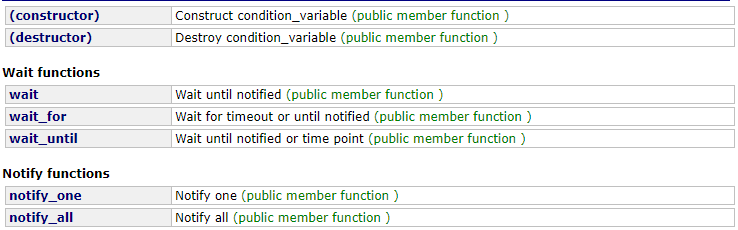

>部分代码转载于：《C++服务器开发精髓》
## condition_variable

* std::condition_variable

```
条件变量（condition_variable）实现多个线程间的同步操作,当条件不满足时，相关线程被一直阻塞，直到某种条件出现，这些线程才会被唤醒。
```

* 成员函数


* 分析
```
1.作用
当需要死循环判断某个条件成立与否时【true or false】，我们往往需要开一个线程死循环来判断，这样非常消耗CPU。使用条件变量，可以让当前线程wait，释放CPU，如果条件改变时，我们再notify退出线程，再次进行判断。

2.必备条件
想要修改共享变量（即“条件”）的线程必须：
	(1)获得一个std::mutex
	(2)持有锁时，执行修改动作
	(3)对std::condition_variable执行notify_one或notify_all(当做notify动作时，不必持有锁)

任意要等待std::condition_variable的线程必须：
	(1)获取std::unique_lock<std::mutex>，这个mutex正是用来保护共享变量（即“条件”）
	(2)执行wait, wait_for或者wait_until. 这些等待动作原子性地释放mutex，并使得线程的执行暂停
	(3)当获得【条件变量的通知，或者超时，或者一个虚假的唤醒】，那么线程就会被唤醒，并且获得mutex. 然后线程应该检查条件是否成立，如果是虚假唤醒，就继续等待。
```

* 例子
```
#include<condition_variable>
#include <mutex>
#include <thread>
#include <list>
#include <chrono>

class Task {
public:
	Task(int Id)
	{
		taskId = Id;
	}
	void doWork()
	{
		std::cout << "handle a task, task id: " << taskId << " ,thread id: " << std::this_thread::get_id() << std::endl;
	}
private:
	int taskId;
};

std::mutex mu;
std::list<Task*> tasks;
std::condition_variable cv;

void* consumer_thread()
{
	Task* pTask = nullptr;
	while (true)
	{
		std::unique_lock<std::mutex> guard(mu);
		/*while (tasks.empty())
		{
			cv.wait(guard);
		}*/

		cv.wait(guard, []() {return !tasks.empty(); });//上面的wait与这行的wait作用相同
		pTask = tasks.front();
		tasks.pop_front();

		guard.unlock();

		if(pTask==nullptr)
			continue;

		pTask->doWork();
		delete pTask;

		pTask = nullptr;
	}

	return nullptr;
}

void* producer_thread()
{
	int taskId = 0;
	Task* task = nullptr;
	while (true)
	{
		task = new Task(taskId);
		{
			std::lock_guard<std::mutex> guard(mu);
			tasks.push_back(task);
			std::cout << "produce a task, task id: " << taskId << " ,thread id: " << std::this_thread::get_id() << std::endl;
		}

		cv.notify_one();

		taskId++;

		std::this_thread::sleep_for(std::chrono::seconds(1));
	}

	return nullptr;
}
int main()
{
	std::thread consumer1(consumer_thread);
	std::thread consumer2(consumer_thread);
	std::thread consumer3(consumer_thread);
	std::thread consumer4(consumer_thread);
	std::thread consumer5(consumer_thread);

	std::thread producer(producer_thread);

	producer.join();
	consumer1.join();
	consumer2.join();
	consumer3.join();
	consumer4.join();
	consumer5.join();
	return 0;
}
```

* 解释

```
1.wait(unique_lock<mutex>& _Lck)方法：
判断是否收到信号，否->释放锁,阻塞当前线程，直到被唤醒；是->重新获取互斥锁
存在问题：可能出现虚假唤醒（存在没有其他线程向条件变量发送信号，但等待此条件变量的线程醒来的情况）。
如何避免：使用while循环对消费者线程被唤醒前后进行条件判断，当满足条件下并且被唤醒，才会进行下一步操作。

2.wait(unique_lock<mutex>& _Lck, _Predicate _Pred)方法：
等同于 
while(!_Pred()) 
	wait(_Lck);

按执行顺序：
(1)当(!_Pred()==true)
(2)未被唤醒->释放锁,阻塞当前线程，直到被唤醒进入步骤(1)；被唤醒->重新获取互斥锁。进入步骤(3)
(3)当(!_Pred()==false)时进行跳出循环，执行下一步操作。当(!_Pred()==true)，释放锁，阻塞。直到收到信号，获取锁，进入步骤(1)

注意事项：
wait(unique_lock<mutex>& _Lck)方法在阻塞时，会释放绑定的互斥体并阻塞线程。因此在调用该函数前应对互斥体有个加锁操作。
收到信号时，wait(unique_lock<mutex>& _Lck)方法会返回并对其绑定的互斥体进行加锁，因此下面必须有对互斥体解锁的操作。
```