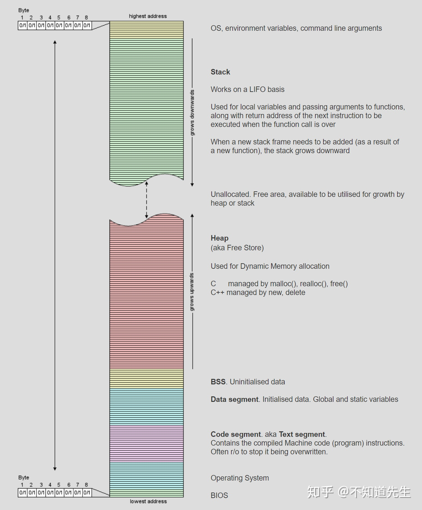

## 内存管理

内存分为5个区

* 堆
* 栈
* 自由存储区
* 全局/静态存储区
* 常量存储区

* 堆
```
内存使用new进行分配，使用delete或delete[]释放。如果未能对内存进行正确的释放，会造成内存泄漏。但在程序结束时，会由操作系统自动回收。
```

* 栈
```
内存由编译器在需要时自动分配和释放。通常用来存储局部变量和函数参数。（为运行函数而分配的局部变量、函数参数、返回地址等存放在栈区）
栈运算分配内置于处理器的指令集中，效率很高，但是分配的内存容量有限。
```

* 自由存储区
```
使用malloc进行分配，使用free进行回收。和堆类似。
```

* 全局/静态存储区
```
全局变量和静态变量被分配到同一块内存中，C语言中区分初始化和未初始化的，C++中不再区分了。（全局变量、静态数据、常量存放在全局数据区），使用静态关键字static声明，在静态存储区申请一个静态变量
```

* 常量存储区
```
常量存储区：存储常量，不允许被修改。
```


* 栈内存与堆内存的区别
```
1.申请后系统的响应
栈：只要栈的剩余空间大于所申请的空间，系统将为程序提供内存，否则将报异常提示栈溢出。

堆：在记录空闲内存地址的链表中寻找一个空间大于所申请空间的堆结点，然后将该结点从空闲结点链表中删除，并将该结点的空间分配给程序。

另外，对于大多数系统会在这块内存空间的首地址出记录本次分配空间的大小，这样代码中的delete 才能正确释放本内存空间。

系统会将多余的那部分重新空闲链表中。

2.申请大小限制
栈：在Windows下,栈是向低地址扩展的数据结构，是一块连续的内存的区域。这句话的意思是栈顶的地址和栈的最大容量是系统预先规定好的，
在 WINDOWS下，栈的大小是2M（也有的说是1M，总之是一个编译时就确定的常数），如果申请的空间超过栈的剩余空间时，将提示overflow。

堆：堆是向高地址扩展的数据结构，是不连续的内存区域。这是由于系统是用链表来存储的空闲内存地址的，自然是不连续的，

而链表的遍历方向是由低地址向高地址。堆的大小受限于计算机系统中有效的虚拟内存。由此可见，堆获得的空间比较灵活，也比较大。

3.分配效率
栈：由系统自动分配，速度较快。但程序员是无法控制的。

堆：由new分配的内存，一般速度比较慢，而且容易产生内存碎片,不过用起来最方便. 另外，在WINDOWS下，最好的方式是用VirtualAlloc分配内存，不是在堆，也不是在栈是直接在进程的地址空间中保留一快内存，虽然用起来最不方便。但是速度快，也灵活 

```


