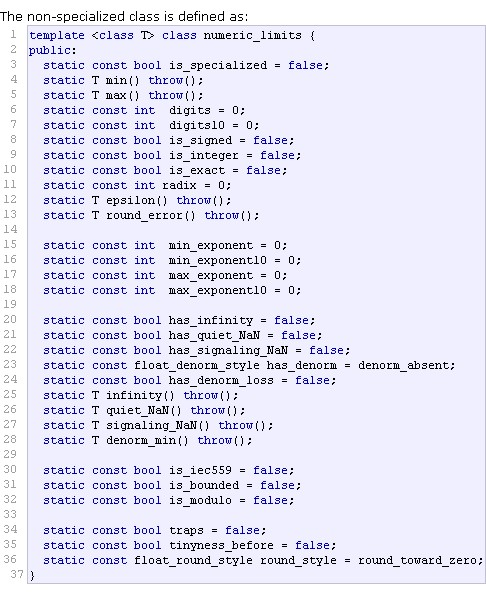

## numeric_limits
转载于：https://blog.csdn.net/yhc166188/article/details/90287807
* 引言
```
c++标准程序库通过template numeric_limits提供这些极值，取代传统C语言所采用的预处理常数。你仍然可以使用后者，其中整数常数定义于<climits>和<limits.h>,浮点常数定义于<cfloat>和<float.h>，新的极值概念有两个优点，一是提供了更好的类型安全性，二是程序员可借此写出一些template以核定这些极值。
```

* 下面是参数的解释

| digits10          | 返回目标类型在十进制下可以表示的最大位数                     |
| ----------------- | ------------------------------------------------------------ |
| epsilon           | 返回目标数据类型能表示的最逼近1的正数和1的差的绝对值         |
| has_denorm        | 测试目标类型是不是可以非规范化表示示                         |
| has_denorm_loss   | 测试所有类型是不是能测出因为非规范化而造成的精度损失（不是因为结果本身的不精确） |
| has_infinity      | 测试目标类型是不是能表示无限（比如被0除，或者其他一些情况）  |
| has_quiet_NaN     | 检查目标类型是不是支持安静类型的NaN                          |
| has_signaling_NaN | 检查目标类型是不是支持信号类型的NaN                          |
| infinity          | 检查目标类型的无限类型（如果支持无限表示）                   |
| is_bounded        | 检查目标类型的取值是否有限                                   |
| is_exact          | 测试目标类型的计算结果是不是**不会**造成舍入误差（比如float是0） |
| is_iec559         | 测试目标类型是不是符合IEC559标准                             |
| is_integer        | 测试目标类型是不是可以用整型来表示（比如char是1，float是0）  |
| is_modulo         | Tests if a type has a modulo representation.                 |
| is_signed         | 测试目标类型是否是带符号的                                   |
| is_specialized    | 测试目标类型是不是在**numeric_limits** .模板类中有特殊定义   |
| max               | 返回可取的有限最大值                                         |
| max_exponent      | Returns the maximum positive integral exponent that the floating-point type can represent as a finite value when a base of radix is raised to that power. |
| max_exponent10    | Returns the maximum positive integral exponent that the floating-point type can represent as a finite value when a base of ten is raised to that power. |
| min               | 返回可取的最小值（规范化）                                   |
| min_exponent      | Returns the maximum negative integral exponent that the floating-point type can represent as a finite value when a base of radix is raised to that power. |
| min_exponent10    | Returns the maximum negative integral exponent that the floating-point type can represent as a finite value when a base of ten is raised to that power. |
| quiet_NaN         | 返回目标类型的安静NAN的表示                                  |
| radix             | Returns the integral base, referred to as radix, used for the representation of a type. |
| round_error       | 返回目标类型的最大可能的舍入误差                             |
| round_style       | Returns a value that describes the various methods that an implementation can choose for rounding a floating-point value to an integer value. |
| signaling_NaN     | 返回目标类型关于信号NAN的表示                                |
| tinyness_before   | 测试目标类型是不是能测定出微小的舍入误差                     |
| traps             | Tests whether trapping that reports on arithmetic exceptions is implemented for a type. |

* 基本使用方法
```
#include<iostream>
#include<limits>
#include<string>

using namespace std;

int main()
{
	cout << boolalpha;

	cout << "max(short):" << numeric_limits<short>::max() << endl;
	cout << "max(int):" << numeric_limits<int>::max() << endl;
	cout << "max(long):" << numeric_limits<long>::max() << endl;

	cout << "max(float):" << numeric_limits<float>::max() << endl;
	cout << "max(double):" << numeric_limits<double>::max() << endl;
	cout << "max(long double):" << numeric_limits<long double>::max() << endl;

	cout << "is_signed(char):" << numeric_limits<char>::is_signed << endl;

	cout << "is_specialized(string):" << numeric_limits<string>::is_specialized << endl;
}
```