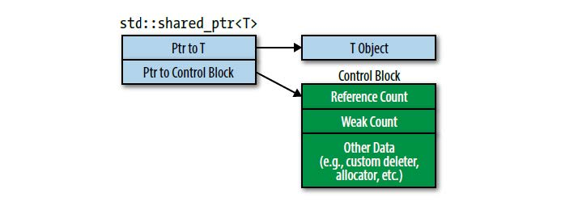

## Item 19:对于共享资源使用std::shared_ptr

部分转载于《Boost程序库完全开发指南(第五版)》

* 引言
```
1.std::shared_ptr为任意共享所有权的资源⼀种⾃动垃圾回收的便捷⽅式。
2.较之于std::unique_ptr，std::shared_ptr对象通常⼤两倍，控制块会产⽣开销，需要原⼦引
⽤计数修改操作。
3.默认资源销毁是通过delete，但是也⽀持⾃定义销毁器。销毁器的类型是什么对于std::shared_ptr的类型没有影响。
4.避免从原始指针变量上创建std::shared_ptr。
```

* 18.1std::shared_ptr类摘要
```
template<class T>				
class shared_ptr{
public:					
	typedef T			element_type;					//内部类型定义
	
	shared_ptr();										//构造函数
	template<class Y> explicit shared_ptr(Y* p);
	template<class Y,class D> shared_ptr(Y* p,D d);
	~shared_ptr();
	shared_ptr(shared_ptr const& r);					//拷贝构造
	shared_ptr& operator=(shared_ptr const& r);			//赋值操作
	template<class Y> shared_ptr& operator=(shared_ptr<Y> const& r);		
	
	void 							reset();			//重置智能指针
	template<class Y> void 			reset(Y* p);				
	template<class Y,class D> void 	reset(Y* p,D d);
    
    T& operator*() const;								//操作符重载
    T& operator->() const;								//操作符重载
    T* get() const;										//获得原始指针
    
    bool unique() const;								//是否唯一
    long use_count() const;								//引用计数
    
    explicit operator bool() const;						//显式bool值转型
    void swap(shared_ptr& b);							//交换指针
};
```

* 18.2 使用方法

```
1.可以多个shared_ptr管理同一个对象
简单用法
std::shared_ptr<int> sp(new int(10));
std::cout << *sp<<std::endl;					//重载运算符

std::shared_ptr<int> sp2 = sp;
std::cout << sp.use_count() << std::endl;		//use_count==2

*sp2 = 100;					//修改sp2指向的值
sp.reset();					//sp不在持有任何指针

稍复杂用法：
class shared {
private:
	std::shared_ptr<int> p;
public:
	shared(std::shared_ptr<int>& _p):p(_p){ }
	void print()
	{
		std::cout << "count: " << p.use_count() << "v= " << *p << std::endl;
	}

};
void print_func(std::shared_ptr<int> p)
{
	std::cout << "count: " << p.use_count() << "v= " << *p << std::endl;
}

std::shared_ptr<int> p(new int(100));
shared s1(p), s2(p);

s1.print();
s2.print();

*p = 20;
print_func(p);

s1.print();

/*输出
count: 3v = 100
count : 3v = 100
count : 4v = 20
count : 3v = 20*/
```

* 18.3 自定义删除器
```
相同类型的shared_ptr如果有不同的删除器也可以互相赋值：
auto customDeleter1 = [](Widget *pw) { … };
auto customDeleter2 = [](Widget *pw) { … };
std::shared_ptr<Widget> pw1(new Widget, customDeleter1);
std::shared_ptr<Widget> pw2(new Widget, customDeleter2);

pw1=pw2;	//pw1引用计数减一，pw2引用计数加一

```

* 18.4 shared_ptr内存结构
      
```
1.⼀个std::shared_ptr对象都是两个指针⼤小。
2.自定义的删除器内存在堆上。
3.控制块包含除了引⽤计数值外的⼀个⾃定义销毁器的拷⻉，当然前提是存在⾃定义销毁器。
4.如果⽤⼾还指定了⾃定义分配器，控制器也会包含⼀个分配器的拷⻉。控制块可能还包含⼀些额外的数据，正如Item21提到的，⼀个次级引⽤计数weak count。
```

* 18.5 控制块创建规则
```
1.std::make_shared总是创建⼀个控制块(参⻅Item21)。它创建⼀个指向新对象的指针，所以可以肯定std::make_shared调⽤时对象不存在其他控制块。
2.当从独占指针上构造出std::shared_ptr时会创建控制块（即std::unique_ptr或者std::auto_ptr）。独占指针没有使⽤控制块，所以指针指向的对象没有关联其他控制块。（作为构造的⼀部分，std::shared_ptr侵占独占指针所指向的对象的独占权，所以std::unique_ptr被设置为null）。
3.当从原始指针上构造出std::shared_ptr时会创建控制块。如果你想从⼀个早已存在控制块的对象上创建std::shared_ptr，你将假定传递⼀个std::shared_ptr或者std::weak_ptr作为构造函数实参，而不是原始指针。⽤std::shared_ptr或者std::weak_ptr作为构造函数实参创建std::shared_ptr不会创建新控制块，因为它可以依赖传递来的智能指针指向控制块。
```
* 18.6 控制块带来的问题
```
1.从原始指针上构造超过⼀个std::shared_ptr会出现未定义行为
因为指向的对象有多个控制块关联。多个控制块意味着多个引⽤计数值，多个引⽤计数值意味着对象将会被销毁多次（每个引⽤计数⼀次）

auto pw = new int; // pw是原始指针
std::shared_ptr<int> spw1(pw); // 为*pw创建控制块
std::shared_ptr<int> spw2(pw); // 为*pw创建第⼆个控制块,出现异常

解决方法：
std::shared_ptr<int> spw1(new int); // 为*pw创建控制块
std::shared_ptr<int> spw2(spw1); // spw2使⽤spw1⼀样的控制块
```

* 18.7 std::enable_shared_from_this
```
⼀个数据结构⽤于跟踪已经处理过的Widget对象
std::vector<std::shared_ptr<Widget>> processedWidgets;

假设Widget有⼀个⽤于处理的成员函数：
class Widget {
public:
	…
	void process();
	…
};

void Widget::process()
{
    … // 处理Widget
    processedWidgets.emplace_back(this); // 然后将他加到已处理过的Widget的列表中
    // 这是错的，因为外部有指向该Wideget的智能指针，此时加入vector会在创建一个控制块，产生析构错误
}

正确做法：
class Widget: public std::enable_shared_from_this<Widget> {
public:
	…
	void process();
	…
};

void Widget::process()
{
    // 和之前⼀样，处理Widget
    …
    // 把指向当前对象的shared_ptr加⼊processedWidgets
    processedWidgets.emplace_back(shared_from_this());
}

注释：
这是奇异递归模板模式
shared_from_this查找当前对象控制块，然后创建⼀个新的std::shared_ptr指向这
个控制块。要想符合设计依据的情况，必须已经存在⼀个指向当前对象的std::shared_ptr (即调⽤shared_from_this的成员函数外⾯已经存在⼀个std::shared_ptr )。如果没有std::shared_ptr指向当前对象（即当前对象没有关联控制块），⾏为是未定义的。shared_from_this通常抛出⼀个异常。
```

