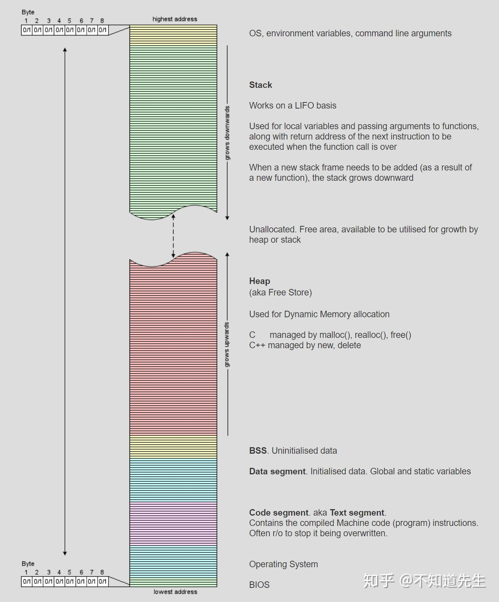
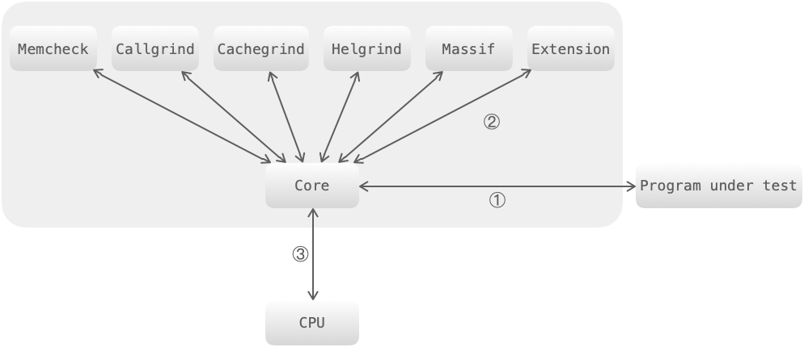
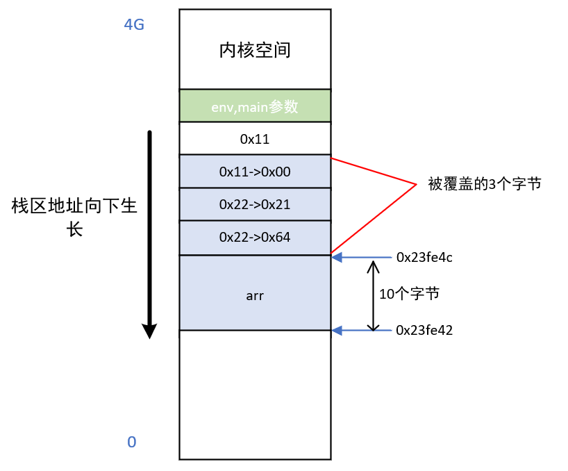
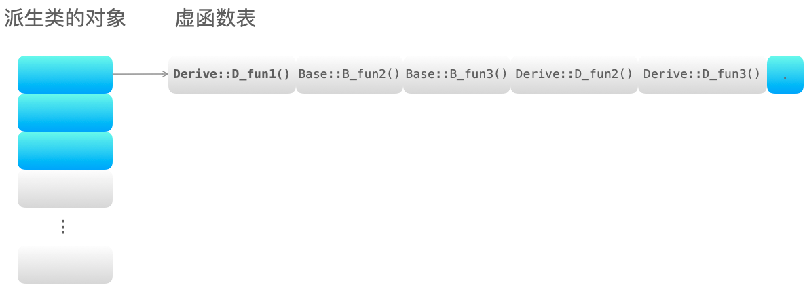

# C++ 面试

部分转载于：https://leetcode-cn.com/leetbook/read/cpp-interview-highlights

* [1 编译内存相关](#1)
  * [1.1 C++程序编译过程](#1-1)
  * [1.2 C++内存管理](#1-2)
  * [1.3 栈和堆的区别](#1-3)
  * [1.4 变量的区别](#1-4)
  * [1.5 全局变量定义在头文件中有什么问题？](#1-5)
  * [1.6 对象创建限制在堆或栈](#1-6)
  * [1.7 内存对齐](#1-7)
  * [1.8 类的大小](#1-8)
  * [1.9 什么是内存泄漏](#1-9)
  * [1.10 如何防止内存泄漏](#1-10)
  * [1.11 智能指针的种类](#1-11)
* [2 面向对象](#2)
  * [2.1 什么是面向对象？面向对象的三大特性](#2-1)
  * [2.2 重载、重写、隐藏的区别](#2-2)
  * [2.3 如何理解 C++ 是面向对象编程](#2-3)
  * [2.4 什么是多态？多态如何实现？](#2-4)
  * [2.5 C++成员变量、构造函数的初始化顺序](#2-5)
* [3 关键字库函数](#3)
  * [3.1 sizeof和strlen的区别](#3-1)
  * [3.2 lambda表达式](#3-2)
  * [3.3 explict的作用](#3-3)
  * [3.4 static的作用](#3-4)
  * [3.5 const的作用](#3-5)
  * [3.6 define和typedef的区别](#3-6)
  * [3.7 inline的作用](#3-7)
  * [3.8 new和delete的作用](#3-8)
  * [3.9 struct和union的作用](#3-9)
  * [3.10 volatile的作用](#3-10)
  * [3.11 extern C的作用](#3-11)
  * [3.12 memmove 和 memcpy的区别以及处理内存重叠问题](#3-12)
  * [3.13 strcpy 函数有什么缺陷](#3-13)
  * [3.14 default和delete在类中的作用](#3-14)
  * [3.15 enable_if的作用](#3-15)
  * [3.16 四种cast的作用](#3-16)
  * [3.17 tuple的作用](#3-17)
  * [3.18 numeric_limits的作用](#3-18)
  * [3.19 functional的作用](#3-19)
  * [3.20 condition_variable的作用](#3-20)
  * [3.21 typename的作用](#3-21)
  * [3.22 using的作用](#3-22)
* [4 类相关](#4)
    * [4.1 调用模板类的模板函数注意事项](#4-1)
    * [4.2 类的六大特殊成员函数](#4-2)
    * [4.3 虚函数与纯虚函数](#4.3)
    * [4.4 虚函数的实现机制](#4-4)
    * [4.5 单继承和多继承的虚函数表结构](#4-5)
    * [4.6 构造函数、析构函数是否需要定义成虚函数？](#4-6)
    * [4.7 多重继承会出现什么状态？如何解决？](#4-7)
    * [4.8 为什么拷贝构造函数必须为引用？](#4-8)
    * [4.9 为什么用成员初始化列表会快一些？](#4-9)
    * [4.10 实例化一个对象需要哪几个阶段](#4-10)
    * [4.11 友元函数的作用及使用场景](#4-11)
    * [4.12 静态绑定和动态绑定是怎么实现的？](#4-12)
    * [4.13 编译期多态和运行期多态的区别](#4-13)
    * [4.14 如何让类不能被继承](#4-14)
* [5 语言特性相关](#5)
* [6 设计模式](#6-1)
	* [6.1 单例模式](#6-1)
	* [6.2 观察者模式](#6-2)
	* [6.3 工厂模式](#6-3)

-------------------------------

## <span id ="1">1 编译内存相关</span>

### <span id = "1-1">1.1 C++程序编译过程</span>

编译过程分为四个过程：编译（编译预处理、编译、优化），汇编，链接。
* **编译预处理**：处理以 # 开头的指令；
* **编译、优化**：将源码 .cpp 文件翻译成 .s 汇编代码；
* **汇编**：将汇编代码 .s 翻译成机器指令 .o 文件；
* **链接**：汇编程序生成的目标文件，即 .o 文件，并不会立即执行，因为可能会出现：.cpp 文件中的函数引用了另一个 .cpp 文件中定义的符号或者调用了某个库文件中的函数。那链接的目的就是将这些文件对应的目标文件连接成一个整体，从而生成可执行的程序 .exe 文件。

链接分为两种：
* **静态链接**：代码从其所在的静态链接库中拷贝到最终的可执行程序中，在该程序被执行时，这些代码会被装入到该进程的虚拟地址空间中。
* **动态链接**：代码被放到动态链接库或共享对象的某个目标文件中，链接程序只是在最终的可执行程序中记录了共享对象的名字等一些信息。在程序执行时，动态链接库的全部内容会被映射到运行时相应进行的虚拟地址的空间。
二者的优缺点：

* **静态链接**：浪费空间，每个可执行程序都会有目标文件的一个副本，这样如果目标文件进行了更新操作，就需要重新进行编译链接生成可执行程序（更新困难）；优点就是执行的时候运行速度快，因为可执行程序具备了程序运行的所有内容。
* **静态链接**：节省内存、更新方便，但是动态链接是在程序运行时，每次执行都需要链接，相比静态链接会有一定的性能损失。

### <span id="1-2">1.2 C++内存管理</span>

C++ 内存分区：栈、堆、全局/静态存储区、常量存储区、代码区。

* **栈**
```
内存由编译器在需要时自动分配和释放。通常用来存储局部变量和函数参数。（为运行函数而分配的局部变量、函数参数、返回地址等存放在栈区）
栈运算分配内置于处理器的指令集中，效率很高，但是分配的内存容量有限。
```

* **堆**
```
内存使用new进行分配，使用delete或delete[]释放。如果未能对内存进行正确的释放，会造成内存泄漏。但在程序结束时，会由操作系统自动回收。
```

* **全局区/静态存储区（.bss 段和 .data 段）**
```
全局变量和静态变量被分配到同一块内存中，C语言中区分初始化和未初始化的，C++中不再区分了。（全局变量、静态数据、常量存放在全局数据区），使用静态关键字static声明，在静态存储区申请一个静态变量。
```

* **常量存储区（.data 段）**
```
存放的是常量，不允许修改，程序运行结束自动释放。
```

* **代码区（.text 段）**
```
存放代码，不允许修改，但可以执行。编译后的二进制文件存放在这里。
```



  说明：
从操作系统的本身来讲，以上存储区在内存中的分布是如下形式(从低地址到高地址)：.text 段 --> .data 段 --> .bss 段 --> 堆 --> unused --> 栈 --> env

* 栈内存与堆内存的区别

```
1.申请后系统的响应
栈：只要栈的剩余空间大于所申请的空间，系统将为程序提供内存，否则将报异常提示栈溢出。

堆：在记录空闲内存地址的链表中寻找一个空间大于所申请空间的堆结点，然后将该结点从空闲结点链表中删除，并将该结点的空间分配给程序。

另外，对于大多数系统会在这块内存空间的首地址出记录本次分配空间的大小，这样代码中的delete 才能正确释放本内存空间。

系统会将多余的那部分重新空闲链表中。

2.申请大小限制
栈：在Windows下,栈是向低地址扩展的数据结构，是一块连续的内存的区域。这句话的意思是栈顶的地址和栈的最大容量是系统预先规定好的，
在 WINDOWS下，栈的大小是2M（也有的说是1M，总之是一个编译时就确定的常数），如果申请的空间超过栈的剩余空间时，将提示overflow。

堆：堆是向高地址扩展的数据结构，是不连续的内存区域。这是由于系统是用链表来存储的空闲内存地址的，自然是不连续的，

而链表的遍历方向是由低地址向高地址。堆的大小受限于计算机系统中有效的虚拟内存。由此可见，堆获得的空间比较灵活，也比较大。

3.分配效率
栈：由系统自动分配，速度较快。但程序员是无法控制的。

堆：由new分配的内存，一般速度比较慢，而且容易产生内存碎片,不过用起来最方便. 另外，在WINDOWS下，最好的方式是用VirtualAlloc分配内存，不是在堆，也不是在栈是直接在进程的地址空间中保留一快内存，虽然用起来最不方便。但是速度快，也灵活 
```


程序实例：

```
#include <iostream>
using namespace std;

/*
说明：C++ 中不再区分初始化和未初始化的全局变量、静态变量的存储区，如果非要区分下述程序标注在了括号中
*/

int g_var = 0; // g_var 在全局区（.data 段）
char *gp_var;  // gp_var 在全局区（.bss 段）

int main()
{
    int var;                    // var 在栈区
    char *p_var;                // p_var 在栈区
    char arr[] = "abc";         // arr 为数组变量，存储在栈区；"abc"为字符串常量，存储在常量区
    char *p_var1 = "123456";    // p_var1 在栈区；"123456"为字符串常量，存储在常量区
    static int s_var = 0;       // s_var 为静态变量，存在静态存储区（.data 段）
    p_var = (char *)malloc(10); // 分配得来的 10 个字节的区域在堆区
    free(p_var);
    return 0;
}
```

### <span id="1-3">1.3 栈和堆的区别</span>

* 申请方式：栈是系统自动分配，堆是程序员主动申请。
* 申请后系统响应：分配栈空间，如果剩余空间大于申请空间则分配成功，否则分配失败栈溢出；申请堆空间，堆在内存中呈现的方式类似于链表（记录空闲地址空间的链表），在链表上寻找第一个大于申请空间的节点分配给程序，将该节点从链表中删除，大多数系统中该块空间的首地址存放的是本次分配空间的大小，便于释放，将该块空间上的剩余空间再次连接在空闲链表上。
* 栈在内存中是连续的一块空间（向低地址扩展）最大容量是系统预定好的，堆在内存中的空间（向高地址扩展）是不连续的。
* 申请效率：栈是有系统自动分配，申请效率高，但程序员无法控制；堆是由程序员主动申请，效率低，使用起来方便但是容易产生碎片。
  
### <span id="1-4">1.4 变量的区别</span>

**全局变量、局部变量、静态全局变量、静态局部变量的区别**
C++ 变量根据定义的位置的不同的生命周期，具有不同的作用域，作用域可分为 6 种：全局作用域，局部作用域，语句作用域，类作用域，命名空间作用域和文件作用域。

从作用域看：

* **全局变量**：具有全局作用域。全局变量只需在一个源文件中定义，就可以作用于所有的源文件。当然，其他不包含全局变量定义的源文件需要用 extern 关键字再次声明这个全局变量。
* **静态全局变量**：具有文件作用域。它与全局变量的区别在于如果程序包含多个文件的话，它作用于定义它的文件里，不能作用到其它文件里，即被 static 关键字修饰过的变量具有文件作用域。这样即使两个不同的源文件都定义了相同名字的静态全局变量，它们也是不同的变量。
* **局部变量**：具有局部作用域。它是自动对象（auto），在程序运行期间不是一直存在，而是只在函数执行期间存在，函数的一次调用执行结束后，变量被撤销，其所占用的内存也被收回。
* **静态局部变量**：具有局部作用域。它只被初始化一次，自从第一次被初始化直到程序运行结束都一直存在，它和全局变量的区别在于全局变量对所有的函数都是可见的，而静态局部变量只对定义自己的函数体始终可见。

从分配内存空间看：

* 静态存储区：全局变量，静态局部变量，静态全局变量。
* 栈：局部变量。

说明：

* 静态变量和栈变量（存储在栈中的变量）、堆变量（存储在堆中的变量）的区别：静态变量会被放在程序的静态数据存储区（.data 段）中（静态变量会自动初始化），这样可以在下一次调用的时候还可以保持原来的赋值。而栈变量或堆变量不能保证在下一次调用的时候依然保持原来的值。
* 静态变量和全局变量的区别：静态变量用 static 告知编译器，自己仅仅在变量的作用范围内可见。

### <span id="1-5">1.5 全局变量定义在头文件中有什么问题？</span>

如果在头文件中定义全局变量，当该头文件被多个文件 include 时，该头文件中的全局变量就会被定义多次，导致重复定义，因此不能再头文件中定义全局变量。

解决方法：https://www.learncpp.com/cpp-tutorial/sharing-global-constants-across-multiple-files-using-inline-variables/

### <span id="1-6">1.6 对象创建限制在堆或栈</span>

创建对象的两种方式：堆创建(使用new创建)和栈创建(一般创建)

* 限制对象只能堆创建：

1. 将析构函数设置为私有。原因：静态对象建立在栈上，是由编译器分配和释放内存空间，编译器为对象分配内存空间时，会对类的非静态函数进行检查，即编译器会检查析构函数的访问性。当析构函数设为私有时，编译器创建的对象就无法通过访问析构函数来释放对象的内存空间，因此，编译器不会在栈上为对象分配内存。
```
class A
{
public:
    A() {}
    void destory()
    {
        delete this;
    }

private:
    ~A()
    {
    }
};
```
用 new 创建的对象，通常会使用 delete 释放该对象的内存空间，但此时类的外部无法调用析构函数，因此类内必须定义一个 destory() 函数，用来释放 new 创建的对象。

无法解决继承问题，因为如果这个类作为基类，析构函数要设置成 virtual，然后在派生类中重写该函数，来实现多态。但此时，析构函数是私有的，派生类中无法访问。

2. 构造函数设置为 protected，并提供一个 public 的静态函数来完成构造，而不是在类的外部使用 new 构造；将析构函数设置为 protected。原因：类似于单例模式，也保证了在派生类中能够访问析构函数。通过调用 create() 函数在堆上创建对象。
```
class A
{
protected:
    A() {}
    ~A() {}

public:
    static A *create()
    {
        return new A();
    }
    void destory()
    {
        delete this;
    }
};
```

限制对象只能栈创建：
1. 将 operator new() 设置为私有。原因：当对象建立在堆上时，是采用 new 的方式进行建立，其底层会调用 operator new() 函数，因此只要对该函数加以限制，就能够防止对象建立在堆上。
```
class A
{
private:
    void *operator new(size_t t) {}    // 注意函数的第一个参数和返回值都是固定的
    void operator delete(void *ptr) {} // 重载了 new 就需要重载 delete
public:
    A() {}
    ~A() {}
};
```


### <span id="1-7">1.7 内存对齐</span>
内存为什么要对齐
```
尽管内存是以字节为单位，但是大部分处理器并不是按字节块来存取内存的.它一般会以双字节,四字节,8字节,16字节甚至32字节为单位来存取内存，我们将上述这些存取单位称为内存存取粒度.

现在考虑4字节存取粒度的处理器取int类型变量（32位系统），该处理器只能从地址为4的倍数的内存开始读取数据。

假如没有内存对齐机制，数据可以任意存放，现在一个int变量存放在从地址1开始的联系四个字节地址中，该处理器去取数据时，要先从0地址开始读取第一个4字节块,剔除不想要的字节（0地址）,然后从地址4开始读取下一个4字节块,同样剔除不要的数据（5，6，7地址）,最后留下的两块数据合并放入寄存器.这需要做很多工作.
```

```
现在有了内存对齐的，int类型数据只能存放在按照对齐规则的内存中，比如说0地址开始的内存。那么现在该处理器在取数据时一次性就能将数据读出来了，而且不需要做额外的操作，提高了效率。
```


内存对齐的规则
1. 对于结构（或联合）的各个成员，第一个成员位于偏移为0，以后每个数据成员的偏移量必须是#pragma pack指定的数值和结构体(或联合)中最大数据成员长度 这2个数值中较小的一个的倍数。
使用伪代码表示： min(#pragma pack, 这个数据成员的自身长度) * N

2. 在数据成员完成各自对齐之后，结构(或联合)本身也要进行对齐，对齐也按照#pragma pack指定的数值和结构(或联合)最大数据成员长度这2个数值中较小的一个进行。

>*tips:如果没有使用#pragma pack指令来显式的指定内存对齐的字节数，则按照默认字节数来对齐，各个平台的默认对齐规则如下：32位CPU默认按照4字节对齐；64位CPU默认按照8字节对齐。*

#pragma pack命令

```
#pragma pack(n) // 使用自定义n字节对齐  n可以为1，2，4，8，16
#pragma pack()  // 使用缺省字节对齐
#pragma pack(show) // 在编译输出窗口以警告的形式显示出当前的内存以几个字节对齐
```

结构体内存对齐示例(64位)
```
#include <stdio.h>
#include <stdint.h>

#pragma pack(1)
typedef struct {
　　/*成员对齐*/
 　　int a;     //长度4 < 1 **按1对齐**；偏移量为0；存放位置区间[0,3]
 　　char b;    //长度1 = 1 **按1对齐**；偏移量为4；存放位置区间[4]
 　　short c;   //长度2 > 1 **按1对齐**；偏移量为5；存放位置区间[5,6]
 　　char d;    //长度1 = 1 **按1对齐**；偏移量为6；存放位置区间[7]
 　　/*整体对齐*/
 　　//整体对齐系数 = min（对齐系数1，最大成员长度4） = 1，无需对齐，整体大小为8；
}test_pack1;
#pragma pack()

 
#pragma pack(2)
typedef struct {　　 /*成员对齐*/
 　　int a;     //长度4 > 2 **按2对齐**；偏移量为0；存放位置区间[0,3]
 　　char b;    //长度1 < 2 **按1对齐**；偏移量为4；存放位置区间[4]
 　　short c;   //长度2 = 2 **按2对齐**；偏移量要提升到2的倍数6；存放位置区间[6,7]
 　　char d;    //长度1 < 2 **按1对齐**；偏移量为7；存放位置区间[8]；共九个字节
　　/*整体对齐*/
　　//整体对齐系数 = min（对齐系数2，最大成员长度4） = 2，将9提升到2的倍数10，整体大小为10；
}test_pack2;
#pragma pack()

#pragma pack(4)
typedef struct {　　 /*成员对齐*/
 　　int a;     //长度4 = 4 **按4对齐**；偏移量为0；存放位置区间[0,3]
 　　char b;    //长度1 < 4 **按1对齐**；偏移量为4；存放位置区间[4]
 　　short c;   //长度2 < 4 **按2对齐**；偏移量要提升到2的倍数6；存放位置区间[6,7]
 　　char d;    //长度1 < 4 **按1对齐**；偏移量为7；存放位置区间[8]；总大小为9
　　/*整体对齐*/
　　//整体对齐系数 = min（对齐系数4，最大成员长度4） = 4，将9提升到4的倍数12，整体大小为12；
}test_pack4;
#pragma pack()

#pragma pack(8)
typedef struct {　　 /*成员对齐*/
 　　int a;     //长度4 < 8 **按4对齐**；偏移量为0；存放位置区间[0,3]
 　　char b;    //长度1 < 8 **按1对齐**；偏移量为4；存放位置区间[4]
 　　short c;   //长度2 < 8 **按2对齐**；偏移量要提升到2的倍数6；存放位置区间[6,7]
 　　char d;    //长度1 < 8 **按1对齐**；偏移量为7；存放位置区间[8]，总大小为9
　　/*整体对齐*/
　　//整体对齐系数 = min（对齐系数8，最大成员长度4） = 4，将9提升到4的倍数12，整体大小为12；
}test_pack8;
#pragma pack()

test_pack1 pack1 = {0x11111111, 0x22, 0x3333, 0x44};
uint8_t *ptrPack1 = (uint8_t *)&pack1;
test_pack2 pack2 = {0x11111111, 0x22, 0x3333, 0x44};
uint8_t *ptrPack2 = (uint8_t *)&pack2;
test_pack4 pack4 = {0x11111111, 0x22, 0x3333, 0x44};
uint8_t *ptrPack4 = (uint8_t *)&pack4;
test_pack8 pack8 = {0x11111111, 0x22, 0x3333, 0x44};
uint8_t *ptrPack8 = (uint8_t *)&pack8;

int main(int argc, char *argv[])
{
　　int i = 0;
　　printf("#pragma pack(1) \tsize:%2d,\t", sizeof(pack1));
　　for(i=0; i<sizeof(pack1); i++)
　　{
        printf("%02x", ptrPack1[i]);
　　}
　　printf("\r\n");

　　printf("#pragma pack(2) \tsize:%2d,\t", sizeof(pack2));
　　for(i=0; i<sizeof(pack2); i++)
　　{
        printf("%02x", ptrPack2[i]);
　　}
　　printf("\r\n");

　　printf("#pragma pack(4) \tsize:%2d,\t", sizeof(pack4));
　　for(i=0; i<sizeof(pack4); i++)
　　{
        printf("%02x", ptrPack4[i]);
　　}
　　printf("\r\n");

　　printf("#pragma pack(8) \tsize:%d,\t", sizeof(pack8));
　　for(i=0; i<sizeof(pack8); i++)
　　{
        printf("%02x", ptrPack8[i]);
　　}
　　printf("\r\n"); 
　　return 0;
}
```

### <span id="1-8">1.8 类的大小</span>

首先来个总结，然后下面给出实际例子，实战！

- 空类的大小为1字节
- 一个类中，虚函数本身、成员函数（包括静态与非静态）和静态数据成员都是不占用类对象的存储空间。
- 对于包含虚函数的类，不管有多少个虚函数，只有一个虚指针,vptr的大小。
- 普通继承，派生类继承了所有基类的函数与成员，要按照字节对齐来计算大小
- 虚函数继承，不管是单继承还是多继承，都是继承了基类的vptr。(32位操作系统4字节，64位操作系统 8字节)！
- 虚继承,继承基类的vptr。

* 原则1

```
/**
 * @file blackclass.cpp
 * @brief 空类的大小为1字节
 * @author 光城
 * @version v1
 * @date 2019-07-21
 */
#include<iostream>
using namespace std;
class A{};
int main()
{
    cout<<sizeof(A)<<endl;
    return 0;
}
```

* 原则2

```
/**
 * @file static.cpp
 * @brief 静态数据成员
 * 静态数据成员被编译器放在程序的一个global data members中，它是类的一个数据成员，但不影响类的大小。不管这个类产生了多少个实例，还是派生了多少新的类，静态数据成员只有一个实例。静态数据成员，一旦被声明，就已经存在。 
 * @author 光城
 * @version v1
 * @date 2019-07-21
 */
#include<iostream>
using namespace std;
class A
{
    public:
        char b;
        virtual void fun() {};
        static int c;
        static int d;
        static int f;
};

int main()
{
    /**
     * @brief 16  字节对齐、静态变量不影响类的大小、vptr指针=8
     */
    cout<<sizeof(A)<<endl; 
    return 0;
}
```

* 原则3

```
/**
 * @file morevir.cpp
 * @brief 对于包含虚函数的类，不管有多少个虚函数，只有一个虚指针,vptr的大小。
 * @author 光城
 * @version v1
 * @date 2019-07-21
 */
#include<iostream>
using namespace std;
class A{
    virtual void fun();
    virtual void fun1();
    virtual void fun2();
    virtual void fun3();
};
int main()
{
    cout<<sizeof(A)<<endl; // 8
    return 0;
}
```

* 原则4与5

```
/**
 * @file geninhe.cpp
 * @brief 1.普通单继承,继承就是基类+派生类自身的大小(注意字节对齐)
 * 注意：类的数据成员按其声明顺序加入内存，与访问权限无关，只看声明顺序。
 * 2.虚单继承，派生类继承基类vptr
 * @author 光城
 * @version v1
 * @date 2019-07-21
 */

#include<iostream>

using namespace std;

class A
{
    public:
        char a;
        int b;
};

/**
 * @brief 此时B按照顺序：
 * char a
 * int b
 * short a
 * long b
 * 根据字节对齐4+4=8+8+8=24
 */
class B:A
{
    public:
        short a;
        long b;
};
class C
{
    A a;
    char c;
};
class A1
{
    virtual void fun(){}
};
class C1:public A1
{
};

int main()
{
    cout<<sizeof(A)<<endl; // 8
    cout<<sizeof(B)<<endl; // 24
    cout<<sizeof(C)<<endl; // 12
    /**
     * @brief 对于虚单函数继承，派生类也继承了基类的vptr，所以是8字节
     */
    cout<<sizeof(C1)<<endl; // 8 
    return 0;
}
```

* 原则6

```
/**
 * @file virnhe.cpp
 * @brief 虚继承
 * @author 光城
 * @version v1
 * @date 2019-07-21
 */

#include<iostream>
using namespace std;
class A
{
    virtual void fun() {}
};
class B
{
    virtual void fun2() {}
};
class C : virtual public  A, virtual public B
{
    public:
        virtual void fun3() {}
};

int main()
{
    /**
     * @brief 8 8 16  派生类虚继承多个虚函数，会继承所有虚函数的vptr
     */
    cout<<sizeof(A)<<" "<<sizeof(B)<<" "<<sizeof(C);

    return 0;
}
```

### <span id="1-9">1.9 什么是内存泄漏</span>

**内存泄漏**：由于疏忽或错误导致的程序未能释放已经不再使用的内存。

进一步解释：

* 并非指内存从物理上消失，而是指程序在运行过程中，由于疏忽或错误而失去了对该内存的控制，从而造成了内存的浪费。

* 常指堆内存泄漏，因为堆是动态分配的，而且是用户来控制的，如果使用不当，会产生内存泄漏。

* 使用 malloc、calloc、realloc、new 等分配内存时，使用完后要调用相应的 free 或 delete 释放内存，否则这块内存就会造成内存泄漏。

* 指针重新赋值

```
char *p = (char *)malloc(10);
char *p1 = (char *)malloc(10);
p = np;
```

开始时，指针 `p` 和 `p1` 分别指向一块内存空间，但指针 `p` 被重新赋值，导致 `p` 初始时指向的那块内存空间无法找到，从而发生了内存泄漏。

### <span id="1-10">1.10 如何防止内存泄漏</span>

1. 使用智能指针：`shared_ptr` 、`unique_ptr`和`weak_ptr`。
2. 内部封装：将内存的分配和释放封装到类中，在构造的时候申请内存，析构的时候释放内存。

```
#include <iostream>
#include <cstring>

using namespace std;

class A
{
private:
    char *p;
    unsigned int p_size;

public:
    A(unsigned int n = 1) // 构造函数中分配内存空间
    {
        p = new char[n];
        p_size = n;
    };
    ~A() // 析构函数中释放内存空间
    {
        if (p != NULL)
        {
            delete[] p; // 删除字符数组
            p = NULL;   // 防止出现野指针
        }
    };
    char *GetPointer()
    {
        return p;
    };
};
void fun()
{
    A ex(100);
    char *p = ex.GetPointer();
    strcpy(p, "Test");
    cout << p << endl;
}
int main()
{
    fun();
    return 0;
}

```

* 内存泄漏检测工具->valgrind 



valgrind 是一套 Linux 下，开放源代码（GPL V2）的仿真调试工具的集合，包括以下工具：

* Memcheck：内存检查器（valgrind 应用最广泛的工具），能够发现开发中绝大多数内存错误的使用情况，比如：使用未初始化的内存，使用已经释放了的内存，内存访问越界等。
* Callgrind：检查程序中函数调用过程中出现的问题。
* Cachegrind：检查程序中缓存使用出现的问题。
* Helgrind：检查多线程程序中出现的竞争问题。
* Massif：检查程序中堆栈使用中出现的问题。
* Extension：可以利用 core 提供的功能，自己编写特定的内存调试工具。

Memcheck 能够检测出内存问题，关键在于其建立了两个全局表：
* Valid-Value 表：对于进程的整个地址空间中的每一个字节（byte），都有与之对应的 8 个 bits ；对于 CPU 的每个寄存器，也有一个与之对应的 bit 向量。这些 bits 负责记录该字节或者寄存器值是否具有有效的、已初始化的值。
* Valid-Address 表：对于进程整个地址空间中的每一个字节（byte），还有与之对应的 1 个 bit，负责记录该地址是否能够被读写。


检测原理：
* 当要读写内存中某个字节时，首先检查这个字节对应的 Valid-Address 表中对应的 bit。如果该 bit 显示该位置是无效位置，Memcheck 则报告读写错误。
* 内核（core）类似于一个虚拟的 CPU 环境，这样当内存中的某个字节被加载到真实的 CPU 中时，该字节在 Valid-Value 表对应的 bits 也被加载到虚拟的 CPU 环境中。一旦寄存器中的值，被用来产生内存地址，或者该值能够影响程序输出，则 Memcheck 会检查 Valid-Value 表对应的 bits，如果该值尚未初始化，则会报告使用未初始化内存错误。

### <span id="1-10">1.11 智能指针的种类</span>

C++11 中智能指针包括以下三种：

* 共享指针（shared_ptr）：资源可以被多个指针共享，使用计数机制表明资源被几个指针共享。通过 use_count() 查看资源的所有者的个数，可以通过 unique_ptr、weak_ptr 来构造，调用 release() 释放资源的所有权，计数减一，当计数减为 0 时，会自动释放内存空间，从而避免了内存泄漏。
* 独占指针（unique_ptr）：独享所有权的智能指针，资源只能被一个指针占有，该指针不能拷贝构造和赋值。但可以进行移动构造和移动赋值构造（调用 move() 函数），即一个 unique_ptr 对象赋值给另一个 unique_ptr 对象，可以通过该方法进行赋值。
* 弱指针（weak_ptr）：指向 share_ptr 指向的对象，能够解决由shared_ptr带来的循环引用问题。
>*Tips:具体请看[Effective modern C++](../Effective-Modern-C++/ReadMe.md)*


## <span id = "2">2 面向对象</span>

### <span id = "2-1">2.1 什么是面向对象？面向对象的三大特性</span>

面向对象：对象是指具体的某一个事物，这些事物的抽象就是类，类中包含数据（成员变量）和动作（成员方法）。

面向对象的三大特性：

* 封装：将具体的实现过程和数据封装成一个函数，只能通过接口进行访问，降低耦合性。
* 继承：子类继承父类的特征和行为，子类有父类的非 private 方法或成员变量，子类可以对父类的方法进行重写，增强了类之间的耦合性，但是当父类中的成员变量、成员函数或者类本身被 final 关键字修饰时，修饰的类不能继承，修饰的成员不能重写或修改。
* 多态：多态就是不同继承类的对象，对同一消息做出不同的响应，基类的指针指向或绑定到派生类的对象，使得基类指针呈现不同的表现方式。


### <span id = "2-2">2.2 重载、重写、隐藏的区别</span>

概念解释：
* 重载：是指同一可访问区内被声明几个具有不同参数列（参数的类型、个数、顺序）的同名函数，根据参数列表确定调用哪个函数，重载不关心函数返回类型。
```
class A
{
public:
    void fun(int tmp);
    void fun(float tmp);        // 重载 参数类型不同（相对于上一个函数）
    void fun(int tmp, float tmp1); // 重载 参数个数不同（相对于上一个函数）
    void fun(float tmp, int tmp1); // 重载 参数顺序不同（相对于上一个函数）
    int fun(int tmp);            // error: 'int A::fun(int)' cannot be overloaded 错误：注意重载不关心函数返回类型
};
```

* 隐藏：是指派生类的函数屏蔽了与其同名的基类函数，主要只要同名函数，不管参数列表是否相同，基类函数都会被隐藏。
```
#include <iostream>
using namespace std;

class Base
{
public:
    void fun(int tmp, float tmp1) { cout << "Base::fun(int tmp, float tmp1)" << endl; }
};

class Derive : public Base
{
public:
    void fun(int tmp) { cout << "Derive::fun(int tmp)" << endl; } // 隐藏基类中的同名函数
};

int main()
{
    Derive ex;
    ex.fun(1);       // Derive::fun(int tmp)
    ex.fun(1, 0.01); // error: candidate expects 1 argument, 2 provided
    return 0;
}

```
说明：上述代码中 `ex.fun(1, 0.01);` 出现错误，说明派生类中将基类的同名函数隐藏了。若是想调用基类中的同名函数，可以加上类型名指明 `ex.Base::fun(1, 0.01);`，这样就可以调用基类中的同名函数。

* 重写(覆盖)：是指派生类中存在重新定义的函数。函数名、参数列表、返回值类型都必须同基类中被重写的函数一致，只有函数体不同。派生类调用时会调用派生类的重写函数，不会调用被重写函数。重写的基类中被重写的函数必须有 virtual 修饰。
```
#include <iostream>
using namespace std;

class Base
{
public:
    virtual void fun(int tmp) { cout << "Base::fun(int tmp) : " << tmp << endl; }
};

class Derived : public Base
{
public:
    virtual void fun(int tmp) { cout << "Derived::fun(int tmp) : " << tmp << endl; } // 重写基类中的 fun 函数
};
int main()
{
    Base *p = new Derived();
    p->fun(3); // Derived::fun(int) : 3
    return 0;
}

```
重写和重载的区别：

* 范围区别：对于类中函数的重载或者重写而言，重载发生在同一个类的内部，重写发生在不同的类之间（子类和父类之间）。
* 参数区别：重载的函数需要与原函数有相同的函数名、不同的参数列表，不关注函数的返回值类型；重写的函数的函数名、参数列表和返回值类型都需要和原函数相同，父类中被重写的函数需要有 virtual 修饰。
* virtual 关键字：重写的函数基类中必须有 virtual关键字的修饰，重载的函数可以有 virtual 关键字的修饰也可以没有。

隐藏和重写，重载的区别：

* 范围区别：隐藏与重载范围不同，隐藏发生在不同类中。
* 参数区别：隐藏函数和被隐藏函数参数列表可以相同，也可以不同，但函数名一定相同；当参数不同时，无论基类中的函数是否被 virtual 修饰，基类函数都是被隐藏，而不是重写。


### <span id = "2-3">2.3 如何理解 C++ 是面向对象编程</span>
* 面向过程编程：一种以执行程序操作的过程或函数为中心编写软件的方法。程序的数据通常存储在变量中，与这些过程是分开的。所以必须将变量传递给需要使用它们的函数。缺点：随着程序变得越来越复杂，程序数据与运行代码的分离可能会导致问题。例如，程序的规范经常会发生变化，从而需要更改数据的格式或数据结构的设计。当数据结构发生变化时，对数据进行操作的代码也必须更改为接受新的格式。查找需要更改的所有代码会为程序员带来额外的工作，并增加了使代码出现错误的机会。

* 面向对象编程（Object-Oriented Programming, OOP）：以创建和使用对象为中心。一个对象（Object）就是一个软件实体，它将数据和程序在一个单元中组合起来。对象的数据项，也称为其属性，存储在成员变量中。对象执行的过程被称为其成员函数。将对象的数据和过程绑定在一起则被称为封装。

* 面向对象编程进一步说明：
面向对象编程将数据成员和成员函数封装到一个类中，并声明数据成员和成员函数的访问级别（public、private、protected），以便控制类对象对数据成员和函数的访问，对数据成员起到一定的保护作用。而且在类的对象调用成员函数时，只需知道成员函数的名、参数列表以及返回值类型即可，无需了解其函数的实现原理。当类内部的数据成员或者成员函数发生改变时，不影响类外部的代码。


### <span id = "2-4">2.4 什么是多态？多态如何实现？</span>
[转载](https://blog.csdn.net/qq_40840459/article/details/80195158?ops_request_misc=%257B%2522request%255Fid%2522%253A%2522163810478316780264046504%2522%252C%2522scm%2522%253A%252220140713.130102334.pc%255Fblog.%2522%257D&request_id=163810478316780264046504&biz_id=0&utm_medium=distribute.pc_search_result.none-task-blog-2~blog~first_rank_v2~hot_rank-1-80195158.pc_v2_rank_blog_default&utm_term=c%2B%2B%E5%A4%9A%E6%80%81%E7%9A%84%E5%AE%9E%E7%8E%B0%E6%96%B9%E5%BC%8F&spm=1018.2226.3001.4450)
多态就是多种形态，C++的多态分为静态多态与动态多态。

* 静态多态就是重载，因为在编译期决议确定，所以称为静态多态。在编译时就可以确定函数地址。
* 动态多态就是通过继承重写基类的虚函数实现的多态，因为实在运行时决议确定，所以称为动态多态。运行时在虚函数表中寻找调用函数的地址。

```
class Person   
{   
public :       
    virtual void BuyTickets()      
    {           
    cout<<" 买票"<< endl;     
    }  
protected :      
    string _name ;   // 姓名   
};  
  
class Student : public Person   
{   
public :  
     virtual void BuyTickets()  
     {           
     cout<<" 买票-半价 "<<endl ;  
     }  
protected :  
     int _num ;   //学号  
};  
  
//void Fun(Person* p)   
void Fun (Person& p)  
{  
     p.BuyTickets ();  
}  
  
void Test ()  
 {  
     Person p ;  
     Student s ;  
     Fun(p );  //cout<<" 买票"<< endl;   
     Fun(s );  //cout<<" 买票-半价 "<<endl ; 
}  
```

* 多态的实现原理
>一个接口，多种方法
1. 用virtual关键字申明的函数叫做虚函数，虚函数肯定是类的成员函数。
2. 存在虚函数的类都有一个一维的虚函数表叫做虚表。当类中声明虚函数时，编译器会在类中生成一个虚函数表。

3. 类的对象有一个指向虚表开始的虚指针。虚表是和类对应的，虚表指针是和对象对应的。

4. 虚函数表是一个存储类成员函数指针的数据结构。

5. 虚函数表是由编译器自动生成与维护的。

6. virtual成员函数会被编译器放入虚函数表中。

7. 当存在虚函数时，每个对象中都有一个指向虚函数的指针（C++编译器给父类对象，子类对象提前布局vptr指针），当进行test(parent *base)函数的时候，C++编译器不需要区分子类或者父类对象，只需要再base指针中，找到vptr指针即可）。

8. vptr一般作为类对象的第一个成员。

* 探索虚表
```
class Base
 {
 public :
     virtual void func1()
    {}
     virtual void func2()
    {}
 private :
     int a ; 
};
 
void Test1 ()
 {
     Base b1;
 }
```


* 单继承模型

```
class Base
{
public :
     virtual void func1()
	 {
		 cout<<"Base::func1" <<endl;
	 }
     virtual void func2()
	 {
		 cout<<"Base::func2" <<endl;
	 } 
private :
     int a ;
};
 
class Derive :public Base
 { 
 public :
	virtual void func1()
    {
		cout<<"Derive::func1" <<endl;
	}
     virtual void func3()
	{ 
	cout<<"Derive::func3" <<endl;
	}
    virtual void func4()
	{
		 cout<<"Derive::func4" <<endl;
	}
private :
     int b ;
};
 
typedef void (* FUNC) ();
void PrintVTable (int* VTable)
 {
     cout<<" 虚表地址>"<< VTable<<endl ;
	 
     for (int i = 0; VTable[i ] != 0; ++i)
		{
			 printf(" 第%d个虚函数地址 :0X%x,->", i , VTable[i ]);
			 FUNC f = (FUNC) VTable[i ];
			 f();
		}
     cout<<endl ;
}
 
void Test1 ()
 {
     Base b1 ;
     Derive d1 ;
     int* VTable1 = (int*)(*( int*)&b1 );
     int* VTable2 = (int*)(*( int*)&d1 );
     PrintVTable(VTable1 );
     PrintVTable(VTable2 );
}
```
可以看到派生类Derive::func1重写基类Base::func1，覆盖了相应虚表位置上的函数。 ps:可以看到这里没有看到派生类Derive中的func3和func4，这两个函数就放在func2的后面，这里没有显示是VS的问题（bug）。


* 多继承模型
```
class Base1
 {
 public :
     virtual void func1()
    {
          cout<<"Base1::func1" <<endl;
    }
     virtual void func2()
    { 
         cout<<"Base1::func2" <<endl;
    }
private :
     int b1 ;
 };
class Base2
 { 
public :
     virtual void func1()
    {
          cout<<"Base2::func1" <<endl;
    }
     virtual void func2()
    {
         cout<<"Base2::func2" <<endl;
   }
private :
     int b2 ;
 };
class Derive : public Base1, public Base2
 { 
public :
virtual void func1()
    { 
         cout<<"Derive::func1" <<endl;
    }
     virtual void func3()
   { 
         cout<<"Derive::func3" <<endl;
    }
private :
     int d1 ; 
};
 
typedef void (* FUNC) ();
void PrintVTable (int* VTable)
 {
     cout<<" 虚表地址>"<< VTable<<endl ;
 
     for (int i = 0; VTable[i ] != 0; ++i)
    { 
         printf(" 第%d个虚函数地址 :0X%x,->", i , VTable[i ]); 
         FUNC f = (FUNC) VTable[i ];
          f();
    }
    cout<<endl ;
 }
 
void Test1 ()
 { 
    Derive d1 ;
    int* VTable = (int*)(*( int*)&d1 );
    PrintVTable(VTable );
     // Base2虚函数表在对象Base1后面    
    VTable = (int *)(*((int*)&d1 + sizeof (Base1)/4));
     PrintVTable(VTable );
 }
```


* 考题
为什么调用普通函数比调用虚函数的效率高？
>因为普通函数是静态联编的，而调用虚函数是动态联编的。
>联编的作用：程序调用函数，编译器决定使用哪个可执行代码块。

* 静态联编 ：在编译的时候就确定了函数的地址，然后call就调用了。
* 动态联编 ： 首先需要取到对象的首地址，然后再解引用取到虚函数表的首地址后，再加上偏移量才能找到要调的虚函数，然后call调用。

为什么要用虚函数表（存函数指针的数组）？
>实现多态，父类对象的指针指向父类对象调用的是父类的虚函数，指向子类调用的是子类的虚函数。
>同一个类的多个对象的虚函数表是同一个，所以这样就可以节省空间，一个类自己的虚函数和继承的虚函数还有重写父类的虚函数都会存在自己的虚函数表。

为什么要把基类的析构函数定义为虚函数？

>在用基类操作派生类时，为了防止执行基类的析构函数，不执行派生类的析构函数。因为这样的删除只能够删除基类对象, 而不能删除子类对象, 形成了删除一半形象, 会造成内存泄漏.如下代码：

```
#include<iostream>  
using namespace std;  
  
class Base  
{  
public:  
    Base() {};  
    ~Base()   
    {  
        cout << "delete Base" << endl;  
    };  
};  
  
class Derived : public Base  
{  
public:  
    Derived() {};  
    ~Derived()  
    {  
        cout << "delete Derived" << endl;  
  
    };  
};  
int main()  
{  
    //操作1  
    Base* p1 = new Derived;  
    delete p1;  
    //因为这里子类的析构函数重写了父类的析构函数，虽然子类和父类的析构函数名不一样，  
    //但是编译器对析构函数做了特殊的处理，在内部子类和父类的析构函数名是一样的。  
    //所以如果不把父类的析构函数定义成虚函数，就不构成多态，由于父类的析构函数隐藏了子类  
    //的析构函数，所以只能调到父类的析构函数。  
    //但是若把父类的析构函数定义成虚函数，那么调用时就会直接调用子类的析构函数，  
    //由于子类析构先要去析构父类，在析构子类，这样就把子类和继承的父类都析构了  
  
    system("pause");  
}  
```

### <span id="2-5">2.5 C++成员变量、构造函数的初始化顺序</span>

1. 成员变量在使用初始化列表初始化时，与构造函数中初始化成员列表的顺序无关，只与成员变量声明的顺序有关。

2. 如果不使用初始化列表初始化，在构造函数内“初始化”时，注意在构造函数运行之前，所有成员变量均进行了默认初始化，在构造函数内的操作均为成员变量`赋值操作`。

3. 类内const成员变量必须在构造函数初始化列表中初始化。（C++11以后支持类内初始化）

4. 类内static成员变量，只能在类外初始化(同一类所有实例共享静态成员变量)，静态类型成员变量的初始化顺序和声明的顺序不一致，只和初始化语句的先后顺序有关。

初始化顺序：
* 1）基类静态变量或全局变量
* 2）派生类静态变量或全局变量
* 3）基类成员变量
* 4）派生类成员变量

```
class A
{
private:
	int n1;
	int n2;
	
public:
	A():n2(0),n1(n2+2){}
 
	void Print(){
		cout << "n1:" << n1 << ", n2: " << n2 <<endl;  
	}
};
 
int main()
{
 
	A a;
	a.Print();
 	//n1:-858993458, n2: 0
	return 0;
}
```
> 在初始化列表中，首先初始化n1，但n2的值未初始化，导致n1值不符合预期。


## <span id="3">3 关键字库函数</span>

### <span id="3-1">3.1 sizeof和strlen的区别</span>

1. `strlen` 是头文件 <cstring> 中的函数，`sizeof` 是 C++ 中的运算符。

2. `strlen` 测量的是字符串的实际长度（其源代码如下），以 `\0` 结束。而 `sizeof` 测量的是字符数组的分配大小。
   `strlen` 源代码:

   ```
   size_t strlen(const char *str) {
       size_t length = 0;
       while (*str++)
           ++length;
       return length;
   }
   ```

   ```
   #include <iostream>
   #include <cstring>
   
   using namespace std;
   
   int main()
   {
       char arr[10] = "hello";
       cout << strlen(arr) << endl; // 5
       cout << sizeof(arr) << endl; // 10
       return 0;
   }
   

3. 若字符数组 arr 作为函数的形参，`sizeof(arr)` 中 arr 被当作字符指针来处理，`strlen(arr)` 中 arr 依然是字符数组，从下述程序的运行结果中就可以看出。

   ```
   #include <iostream>
   #include <cstring>
   
   using namespace std;
   
   void size_of(char arr[])
   {
       cout << sizeof(arr) << endl; // warning: 'sizeof' on array function parameter 'arr' will return size of 'char*' .
       cout << strlen(arr) << endl; 
   }
   
   int main()
   {
       char arr[20] = "hello";
       size_of(arr); 
       return 0;
   }
   /*
   输出结果：
   20
   5
   */


### <span id="3-2">3.2 lambda表达式</span>

lambda 表达式是一个可调度的代码单元，可以视为一个未命名的内部函数。
lambda 函数是一个函数对象，编译器在编译时会生成一个 lambda 对象的类，然后再生成一个该命令未命名的对象。

```
Lambda 表达式的基本语法如下：
[捕获列表](参数列表) mutable(可选) 异常属性-> 返回类型{
// 函数体
}
```

* 1.值捕获
```
与参数传值类似，值捕获的前提是变量可以拷贝，不同之处则在于，被捕获的变量在lambda
表达式被创建时拷贝，而非调用时才拷贝：

void lambda_value_capture() {
    int value = 1;
    auto copy_value = [value] {
    	return value;
    };
    value = 100;
    auto stored_value = copy_value();
    std::cout << "stored_value = " << stored_value << std::endl;
    // 这时, stored_value == 1, 而value == 100.
    // 因为copy_value 在创建时就保存了一份value 的拷贝
}
```

* 2.引用捕获
```
与引用传参类似，引用捕获保存的是引用，值会发生变化。
void lambda_reference_capture() {
    int value = 1;
    auto copy_value = [&value] {
    	return value;
    };
    value = 100;
    auto stored_value = copy_value();
    std::cout << "stored_value = " << stored_value << std::endl;
    // 这时, stored_value == 100, value == 100.
    // 因为copy_value 保存的是引用
}
```

* 3.隐式捕获
```
手动书写捕获列表有时候是非常复杂的，这种机械性的工作可以交给编译器来处理，这时候可以在捕获列表中写一个& 或= 向编译器声明采用引用捕获或者值捕获。
总结一下，捕获提供了lambda 表达式对外部值进行使用的功能，捕获列表的最常用的四种形式可以是：
	[] 空捕获列表
	[name1, name2, . . . ] 捕获一系列变量
	[&] 引用捕获, 让编译器自行推导捕获列表
	[=] 值捕获, 让编译器执行推导引用列表
```

* 4.表达式捕获
```
上面提到的值捕获、引用捕获都是已经在外层作用域声明的变量，因此这些捕获方式捕获的均为左值，而不能捕获右值。
C++14 给与了我们方便，允许捕获的成员用任意的表达式进行初始化，这就允许了右值的捕获，被声明的捕获变量类型会根据表达式进行判断，判断方式与使用auto 本质上是相同的：

int main() {
    auto important = std::make_unique<int>(1);
    auto add = [v1 = 1, v2 = std::move(important)](int x, int y) -> int {
    	return x+y+v1+(*v2);
    };
    std::cout << add(3,4) << std::endl;
    return 0;
}

在上面的代码中，important 是一个独占指针，是不能够被捕获到的，这时候我们需要将其转移为右值，在表达式中初始化。
```

* 泛型Lambda
```
从C++14 开始，Lambda 函数的形式参数可以使用auto关键字来产生意义上的泛型：
auto add = [](auto x, auto y) {
	return x+y;
};
add(1, 2);
add(1.1, 2.2);
```

* return type
```
与普通函数不同的是: lambda 必须使用位尾置返回来指定返回类型。
如果忽略返回类型，lambda 表达式会根据函数体中的代码推断出返回类型。
若函数体只有一个 return 语句， 则返回类型从返回表达式的类型推断而来，否则，若未指定返回类型，返回类型为 void。
```

### <span id="3-3">3.3 explict的作用</span>

explicit关键字作用于单个参数的构造函数。

```

class test{
public:
    explicit test(int a); //单个参数
    explicit test(int a, int b = 5); //只有一个参数待确定
};
```

防止隐式类型转换

```
test ctx = 5;//编译错误
```

禁止隐式的拷贝构造

```
explicit test(test&);

test a(2);
test b = a; //相当于 test b = test(a) 隐式拷贝构造 引发编译错误
```

### <span id="3-4">3.4 static的作用</span>

1. static修饰的常规变量，从生命周期和作用域进行分析：

* 生命周期： 从定义该变量该开始，直到程序结束时
* 作用域：
	* 若是局部变量，则作用域就是定义该变量的函数块范围
	* 若是全局变量，则是定义该变量的文件范围内部，也即是 static 修饰的变量具有文件作用域
```
static 定义变量的位置在静态变量区，超过其作用域该变量并不被释放，而是在函数结束时释放
static 修饰的变量只会被初始化一次
```
```
#include <iostream> 
#include <string> 
using namespace std;

void demo()
{
	static int count = 0;
	cout << count << " ";
	count++;
}

int main()
{
	for (int i = 0; i < 5; i++)
		demo();
	//0 1 2 3 4
	return 0;
}
```

2. static 修饰类：

* static 修饰的成员变量要在类外初始化，属于类，为所有类对象共享，static 修饰的变量不占类的空间
* static 修饰的函数，静态成员函数， 属于类，为类的所有对象共享， 不能访问类的非静态成员，和外部函数， 没有this指针，因此只能访问静态成员(静态成员变量和静态函数)

2.1 类对象为静态

就像变量一样，对象也在声明为static时具有范围，直到程序的生命周期。

考虑以下程序，其中对象是非静态的。

```
#include<iostream> 
using namespace std; 

class Apple 
{ 
	int i; 
	public: 
		Apple() 
		{ 
			i = 0; 
			cout << "Inside Constructor\n"; 
		} 
		~Apple() 
		{ 
			cout << "Inside Destructor\n"; 
		} 
}; 

int main() 
{ 
	int x = 0; 
	if (x==0) 
	{ 
		Apple obj; 
	} 
	cout << "End of main\n"; 
} 
```

输出：

```
Inside Constructor
Inside Destructor
End of main
```

在上面的程序中，对象在if块内声明为非静态。因此，变量的范围仅在if块内。因此，当创建对象时，将调用构造函数，并且在if块的控制权越过析构函数的同时调用，因为对象的范围仅在声明它的if块内。 如果我们将对象声明为静态，现在让我们看看输出的变化。

```
#include<iostream> 
using namespace std; 

class Apple 
{ 
	int i; 
	public: 
		Apple() 
		{ 
			i = 0; 
			cout << "Inside Constructor\n"; 
		} 
		~Apple() 
		{ 
			cout << "Inside Destructor\n"; 
		} 
}; 

int main() 
{ 
	int x = 0; 
	if (x==0) 
	{ 
		static Apple obj; 
	} 
	cout << "End of main\n"; 
} 
```

输出：

```
Inside Constructor
End of main
Inside Destructor
```

您可以清楚地看到输出的变化。现在，在main结束后调用析构函数。这是因为静态对象的范围是贯穿程序的生命周期。

2.2 类中的静态函数

态成员函数。但建议使用类名和范围解析运算符调用静态成员。

允许静态成员函数仅访问静态数据成员或其他静态成员函数，它们无法访问类的非静态数据成员或成员函数。

```
#include<iostream> 
using namespace std; 

class Apple 
{ 
    public: 
        // static member function 
        static void printMsg() 
        {
            cout<<"Welcome to Apple!"; 
        }
}; 

// main function 
int main() 
{ 
    // invoking a static member function 
    Apple::printMsg(); 
} 
```

输出：

```
Welcome to Apple!
```

### <span id="3-5">3.5 const的作用</span>

1. const含义

常类型是指使用类型修饰符**const**说明的类型，常类型的变量或对象的值是不能被更新的。

2. const作用

- 可以定义常量

- define 和 const 的区别

1. 编译阶段：`define` 是在编译预处理阶段进行替换，`const` 是在编译阶段确定其值。
2. 安全性：`define` 定义的宏常量没有数据类型，只是进行简单的替换，不会进行类型安全的检查；`const` 定义的常量是有类型的，是要进行判断的，可以避免一些低级的错误。
3. 内存占用：`define` 定义的宏常量，在程序中使用多少次就会进行多少次替换，内存中有多个备份，占用的是代码段的空间；`const `定义的常量占用静态存储区的空间，程序运行过程中只有一份。
4. 调试：`define` 定义的宏常量不能调试，因为在预编译阶段就已经进行替换了；`const` 定义的常量可以进行调试。

- const的优点

1. 有数据类型，在定义式可进行安全性检查。
2. 可调式。
3. 占用较少的空间。

3. const对象默认为文件局部变量

注意：非const变量默认为extern。要使const变量能够在其他文件中访问，必须在文件中显式地指定它为extern。

> 未被const修饰的变量在不同文件的访问

```
// file1.cpp
int ext
// file2.cpp
#include<iostream>

extern int ext;
int main(){
    std::cout<<(ext+10)<<std::endl;
}
```

> const常量在不同文件的访问

```
//extern_file1.cpp
extern const int ext=12;
//extern_file2.cpp
#include<iostream>
extern const int ext;
int main(){
    std::cout<<ext<<std::endl;
}
```

> 小结：
> 可以发现未被const修饰的变量不需要extern显式声明！而const常量需要显式声明extern，并且需要做初始化！因为常量在定义后就不能被修改，所以定义时必须初始化。

4. 定义常量

```
const int b = 10;
b = 0; // error: assignment of read-only variable ‘b’
const string s = "helloworld";
const int i,j=0 // error: uninitialized const ‘i’
```

上述有两个错误：

- b 为常量，不可更改！
- i 为常量，必须进行初始化！(因为常量在定义后就不能被修改，所以定义时必须初始化。)

5. 指针与const

与指针相关的const有四种：

```
const char * a; //指向const对象的指针或者说指向常量的指针。
char const * a; //同上
char * const a; //指向类型对象的const指针。或者说常指针、const指针。
const char * const a; //指向const对象的const指针。
```

> **小结：**
> 如果*const*位于`*`的左侧，则const就是用来修饰指针所指向的变量，即指针指向为常量；
> 如果const位于`*`的右侧，*const*就是修饰指针本身，即指针本身是常量。

具体使用如下：

（1） **指向常量的指针**

```
const int *ptr;
*ptr = 10; //error
```

ptr是一个指向int类型const对象的指针，const定义的是int类型，也就是ptr所指向的对象类型，而不是ptr本身，所以ptr可以不用赋初始值。但是不能通过ptr去修改所指对象的值。

除此之外，也不能使用void`*`指针保存const对象的地址，必须使用const void`*`类型的指针保存const对象的地址。

```
const int p = 10;
const void * vp = &p;
void *vp = &p; //error
```

另外一个重点是：**允许把非const对象的地址赋给指向const对象的指针**。

将非const对象的地址赋给const对象的指针:

```
const int *ptr;
int val = 3;
ptr = &val; //ok
```

我们不能通过ptr指针来修改val的值，即使它指向的是非const对象!

我们不能使用指向const对象的指针修改基础对象，然而如果该指针指向了非const对象，可用其他方式修改其所指的对象。可以修改const指针所指向的值的，但是不能通过const对象指针来进行而已！如下修改：

```
int *ptr1 = &val;
*ptr1=4;
cout<<*ptr<<endl;
```

> 小结：
> 1.对于指向常量的指针，不能通过指针来修改对象的值。
> 2.不能使用void`*`指针保存const对象的地址，必须使用const void`*`类型的指针保存const对象的地址。
> 3.允许把非const对象的地址赋值给const对象的指针，如果要修改指针所指向的对象值，必须通过其他方式修改，不能直接通过当前指针直接修改。

（2） **常指针**

const指针必须进行初始化，且const指针的值不能修改。

```
#include<iostream>
using namespace std;
int main(){

    int num=0;
    int * const ptr=&num; //const指针必须初始化！且const指针的值不能修改
    int * t = &num;
    *t = 1;
    cout<<*ptr<<endl;
}
```

上述修改ptr指针所指向的值，可以通过非const指针来修改。

最后，当把一个const常量的地址赋值给ptr时候，由于ptr指向的是一个变量，而不是const常量，所以会报错，出现：const int`*` -> int `*`错误！

```
#include<iostream>
using namespace std;
int main(){
    const int num=0;
    int * const ptr=&num; //error! const int* -> int*
    cout<<*ptr<<endl;
}
```

上述若改为 const int `*`ptr或者改为const int `*`const ptr，都可以正常！

（3）**指向常量的常指针**

理解完前两种情况，下面这个情况就比较好理解了：

```
const int p = 3;
const int * const ptr = &p; 
```

ptr是一个const指针，然后指向了一个int 类型的const对象。

6. 函数中使用const

> const修饰函数返回值

这个跟const修饰普通变量以及指针的含义基本相同：

（1）**const int**

```
const int func1();
```

这个本身无意义，因为参数返回本身就是赋值给其他的变量！

（2）**const int***

```
const int* func2();
```

指针指向的内容不变。

（3）int *const

```
int *const func2();
```

指针本身不可变。

> const修饰函数参数

（1）传递过来的参数及指针本身在函数内不可变，无意义！

```
void func(const int var); // 传递过来的参数不可变
void func(int *const var); // 指针本身不可变
```

表明参数在函数体内不能被修改，但此处没有任何意义，var本身就是形参，在函数内不会改变。包括传入的形参是指针也是一样。

输入参数采用“值传递”，由于函数将自动产生临时变量用于复制该参数，该输入参数本来就无需保护，所以不要加const 修饰。

（2）**参数指针所指内容为常量不可变**

```
void StringCopy(char *dst, const char *src);
```

其中src 是输入参数，dst 是输出参数。给src加上const修饰后，如果函数体内的语句试图改动src的内容，编译器将指出错误。这就是加了const的作用之一。

（3）**参数为引用，为了增加效率同时防止修改。**

```
void func(const A &a)
```

对于非内部数据类型的参数而言，象void func(A a) 这样声明的函数注定效率比较低。因为函数体内将产生A 类型的临时对象用于复制参数a，而临时对象的构造、复制、析构过程都将消耗时间。

为了提高效率，可以将函数声明改为void func(A &a)，因为“引用传递”仅借用一下参数的别名而已，不需要产生临 时对象。

> 但是函数void func(A &a) 存在一个缺点：
>
> “引用传递”有可能改变参数a，这是我们不期望的。解决这个问题很容易，加const修饰即可，因此函数最终成为 void func(const A &a)。

以此类推，是否应将void func(int x) 改写为void func(const int &x)，以便提高效率？完全没有必要，因为内部数

据类型的参数不存在构造、析构的过程，而复制也非常快，“值传递”和“引用传递”的效率几乎相当。

> 小结：
> 1.对于非内部数据类型的输入参数，应该将“值传递”的方式改为“const 引用传递”，目的是提高效率。例如将void func(A a) 改为void func(const A &a)。
>
> 2.对于内部数据类型的输入参数，不要将“值传递”的方式改为“const 引用传递”。否则既达不到提高效率的目的，又降低了函数的可理解性。例如void func(int x) 不应该改为void func(const int &x)。

以上解决了两个面试问题：

- 如果函数需要传入一个指针，是否需要为该指针加上const，把const加在指针不同的位置有什么区别；
- 如果写的函数需要传入的参数是一个复杂类型的实例，传入值参数或者引用参数有什么区别，什么时候需要为传入的引用参数加上const。

7. 类中使用const

在一个类中，任何不会修改数据成员的函数都应该声明为const类型。如果在编写const成员函数时，不慎修改 数据成员，或者调用了其它非const成员函数，编译器将指出错误，这无疑会提高程序的健壮性。

使用const关键字进行说明的成员函数，称为常成员函数。只有常成员函数才有资格操作常量或常对象，没有使用const关键字进行说明的成员函数不能用来操作常对象。

对于类中的const成员变量必须通过初始化列表进行初始化，如下所示：

```
class Apple{
private:
    int people[100];
public:
    Apple(int i); 
    const int apple_number;
};

Apple::Apple(int i):apple_number(i)
{

}
```

const对象只能访问const成员函数,而非const对象可以访问任意的成员函数,包括const成员函数.

例如：

```
//apple.cpp
class Apple
{
private:
    int people[100];
public:
    Apple(int i); 
    const int apple_number;
    void take(int num) const;
    int add(int num);
	int add(int num) const;
    int getCount() const;

};
//main.cpp
#include<iostream>
#include"apple.cpp"
using namespace std;

Apple::Apple(int i):apple_number(i)
{

}
int Apple::add(int num){
    take(num);
}
int Apple::add(int num) const{
    take(num);
}
void Apple::take(int num) const
{
    cout<<"take func "<<num<<endl;
}
int Apple::getCount() const
{
    take(1);
//    add(); //error
    return apple_number;
}
int main(){
    Apple a(2);
    cout<<a.getCount()<<endl;
    a.add(10);
    const Apple b(3);
    b.add(100);
    return 0;
}
```

> 编译： g++ -o main main.cpp apple.cpp

结果：

```
take func 1
2
take func 10
take func 100
```

上面getCount()方法中调用了一个add方法，而add方法并非const修饰，所以运行报错。也就是说const对象只能访问const成员函数。

而add方法又调用了const修饰的take方法，证明了非const对象可以访问任意的成员函数,包括const成员函数。

除此之外，我们也看到add的一个重载函数，也输出了两个结果，说明const对象默认调用const成员函数。

我们除了上述的初始化const常量用初始化列表方式外，也可以通过下面方法：

第一：将常量定义与static结合，也就是：

```
static const int apple_number
```

第二：在外面初始化：

```
const int Apple::apple_number=10;
```

当然，如果你使用c++11进行编译，直接可以在定义出初始化，可以直接写成：

```
static const int apple_number=10;
// 或者
const int apple_number=10;
```

这两种都在c++11中支持！

编译的时候加上`-std=c++11`即可！

这里提到了static，下面简单的说一下：

在C++中，static静态成员变量不能在类的内部初始化。在类的内部只是声明，定义必须在类定义体的外部，通常在类的实现文件中初始化。

在类中声明：

```
static int ap;
```

在类实现文件中使用：

```
int Apple::ap=666
```

对于此项，c++11不能进行声明并初始化，也就是上述使用方法。


### <span id="3-6">3.6 define和typedef的区别</span>

* 原理：`#define` 作为预处理指令，在编译预处理时进行替换操作，不作正确性检查，只有在编译已被展开的源程序时才会发现可能的错误并报错。`typedef` 是关键字，在编译时处理，有类型检查功能，用来给一个已经存在的类型一个别名，但不能在一个函数定义里面使用 `typedef `。

* 功能：`typedef` 用来定义类型的别名，方便使用。`#define` 不仅可以为类型取别名，还可以定义常量、变量、编译开关等。

* 作用域：`#define` 没有作用域的限制，只要是之前预定义过的宏，在以后的程序中都可以使用，而 `typedef `有自己的作用域。

* 指针的操作：`typedef` 和`#define` 在处理指针时不完全一样

```
#include <iostream>
#define INTPTR1 int *
typedef int * INTPTR2;

using namespace std;

int main()
{
    INTPTR1 p1, p2; // p1: int *; p2: int
    INTPTR2 p3, p4; // p3: int *; p4: int *

    int var = 1;
    const INTPTR1 p5 = &var; // 相当于 const int * p5; 常量指针，即不可以通过 p5 去修改 p5 指向的内容，但是 p5 可以指向其他内容。
    const INTPTR2 p6 = &var; // 相当于 int * const p6; 指针常量，不可使 p6 再指向其他内容。
    
    return 0;
}
```

### <span id="3-7">3.7 inline的作用</span>

* **内联函数的作用**：
1. 消除函数调用的开销。
在内联函数出现之前，程序员通常用 #define 定义一些“函数”来消除调用这些函数的开销。内联函数设计的目的之一，就是取代 #define 的这项功能（因为使用 #define 定义的那些“函数”，编译器不会检查其参数的正确性等，而使用 inline 定义的函数，和普通函数一样，可以被编译器检查，这样有利于尽早发现错误）。
2. 去除函数只能定义一次的限制。
内联函数可以在头文件中被定义，并被多个 .cpp 文件 include，而不会有重定义错误。这也是设计内联函数的主要目的之一。
* **关于减少函数调用的开销**：
1. 内联函数一定会被编译器在调用点展开吗？
错，inline 只是对编译器的建议，而非命令。编译器可以选择忽视 inline。当程序员定义的 inline 函数包含复杂递归，或者 inlinie 函数本身比较长，编译器一般不会将其展开，而仍然会选择函数调用。
2. “调用”普通函数时，一定是调用吗？
错，即使是普通函数，编译器也可以选择进行优化，将普通函数在“调用”点展开。
3. 既然内联函数在编译阶段已经在调用点被展开，那么程序运行时，对应的内存中不包含内联函数的定义，对吗？
错。首先，如第一点所言，编译器可以选择调用内联函数，而非展开内联函数。因此，内存中仍然需要一份内联函数的定义，以供调用。
而且，一致性是所有语言都应该遵守的准则。普通函数可以有指向它的函数指针，那么，内敛函数也可以有指向它的函数指针，因此，内存中需要一份内联函数的定义，使得这样的函数指针可以存在。
* **关于去除函数只能定义一次的限制**：

下述程序会报错：
```
// 文件1
#include <iostream>

using namespace std;

void myPrint() {
	cout << "function 1";
}

// 文件2
#include <iostream>

using namespace std;

void myPrint() {
	cout << "function 2";
}

int main() {
	myPrint();  // error，会出现链接时错误， myPrint 函数被定义了两次。
}
```
 而下述程序不会报错
```
// 文件1
#include <iostream>

using namespace std;

inline void myPrint() {
	cout << "inline function 1";
}

// 文件2
#include <iostream>

using namespace std;

inline void myPrint() {
	cout << "inline function 2";
}

int main() {
	myPrint()	// 正常运行;
}
```
> 可见，内联函数可以在头文件中定义（即多个 .cpp 源文件可以定义函数名、参数都一样的内联函数，而不会有重定义错误）。

* **类成员函数如何变为内联函数**
1. 类成员函数同时声明并定义默认是内联函数
```
#include <iostream>
using namespace std;

class A{
public:
    int var;
    A(int tmp){ 
      var = tmp;
    }    
    void fun(){ 
        cout << var << endl;
    }
};

int main()
{    
    return 0;
}
```
2. 类外定义成员函数，若想定义为内联函数，需用关键字声明
```
#include <iostream>
using namespace std;

class A{
public:
    int var;
    A(int tmp){ 
      var = tmp;
    }    
    void fun();
};

inline void A::fun(){
    cout << var << endl;
}

int main()
{    
    return 0;
}
```
> 另外，可以在声明函数和定义函数的同时加上 `inline`；也可以只在函数声明时加 `inline`，而定义函数时不加 `inline`。只要确保在调用该函数之前把 `inline` 的信息告知编译器即可。


### <span id="3-8">3.8 new和delete的作用</span>
转载于：https://www.jianshu.com/p/d2d5cdd7aa1d
* new和delete的内部实现
C++中如果要在堆内存中创建和销毁对象需要借助关键字new和delete来完成。比如下面的代码
```
class CA
{
    public:
       CA():m_a(0){}
       CA(int a):m_a(a){}

       virtual void foo(){ cout<<m_a<<endl;}
       int m_a;
};

void main()
{
       CA *p1 = new CA;
       CA *p2 = new CA(10);
       CA *p3 = new CA[20];

       delete p1;
       delete p2;
       delete[] p3;
}
```
new和delete既是C++中的关键字也是一种特殊的运算符。
```
void* operator new(size_t size);
void* operator new[](size_t size);
void  operator delete(void *p);
void  operator delete[](void *p);
```
new和delete不仅承载着内存分配的功能还承载着对象构造函数的调用功能，因此上面的对象创建代码其实在编译时会转化为如下的实现：
```
      CA *p1 = operator new(sizeof(CA));  //分配堆内存
      CA::CA(p1);   //调用构造函数

      CA *p2 = operator new(sizeof(CA));  //分配堆内存
      CA::CA(p2, 10);   //调用构造函数
     
      CA *p3 = operator new[](20 * sizeof(CA));
      CA *pt = p3;
      for (int i = 0; i < 20; i++)
     {
         CA::CA(pt);
         pt += 1;
     }

     CA::~CA(p1);
     operator delete(p1);
     
     CA::~CA(p2);
     operator delete(p2);

     CA *pt = p3;
     for (int i = 0; i < 20; i++)
     {
          CA::~CA(pt);
          pt += 1;
     }
     operator delete[](p3);
```
看到上面的代码也许你会感到疑惑，怎么在编译时怎么会在源代码的基础上插入这么多的代码。这也是很多C程序员吐槽C++语言的原因：`C++编译器会偷偷插入很多未知的代码或者对源代码进行修改和处理，而这些插入和修改动作对于程序员来说是完全不可知的！`

言归正传，我们还能从上面的代码中看出new和delete操作其实是分别进行了2步操作：1.内存的分配，2.构造函数的调用；3.析构函数的调用，4.内存的销毁。所以当对象是从堆内存分配时，构造函数执前内存就已经完成分配，同样当析构函数执行完成后内存才会被销毁。

这里面一个有意思的问题就是当我们分配或者销毁的是数组对象时，系统又是如何知道应该调用多少次构造函数以及调用多少次析构函数的呢？答案就是在内存分配里面。当我们调用operator new[]来分配数组对象时，编译器时系统内部会增加4或者8字节的分配空间用来保存所分配的数组对象的数量。当对数组对象调用构造和析构函数时就可以根据这个数量值来进行循环处理了。因此上面对数组对象的分配和销毁的真实代码其实是按如下方式处理的：
```
//  CA *p3 = new CA[20]; 这句代码在编译时其实会转化为如下的代码片段
unsigned long *p = operator new[](20 * sizeof(CA) + sizeof(unsigned long));  //64位系统多分配8字节
*p = 20;   //这里保存分配的对象的数量。
CA *p3 = (CA*)(p + 1);
CA *pt = p3;
for (int i = 0; i < *p; i++)
{
    CA::CA(pt);
    pt += 1;
}


// delete[] p3;   这句代码在编译时其实会转化为如下的代码片段
unsigned long *p =  ((unsigned long*)p3)  - 1;
CA *pt = p3;
for (int i = 0; i < *p; i++)
{
    CA::~CA(pt);
    pt += 1;
}
operator delete[](p);
```
可见C++中为我们隐藏了多少细节啊！ 这里需要注意的是分配数组内存时会增加额外的存储空间来保存数量的情况只会发生在对类进行内存分配的情况，而对于基础类型进行内存分配则不会增加额外的空间来保存数量，比如下面的代码：
```
int *p = new int[30];
```
之所以会有这种差异的原因是因为类对象的构建和销毁时存在着构造函数和析构函数的调用，因此必须要保存数量来对每个元素进行函数调用的遍历处理，而普通类型则没有这个步骤。这也是编译器对各种类型数据的构建和销毁的一个优化处理。

既然new和delete操作默认是从堆中进行内存分配，而且new和delete又是一个普通的运算符函数，那么他内部是如何实现呢？其实也很简单。我们知道C语言中堆内存分配和销毁的函数是malloc/free。因此C++中对系统默认的new和delete运算符函数就可以按如下的方法实现：
```
void * operator new(size_t size)
{
     return malloc(size);
} 

void * operator new[](size_t size)
{
     return malloc(size);
}

void operator delete(void *p)
{
     free(p);
}

void operator delete[](void *p)
{
    free(p);
}
```
这里需要注意的是你在代码里面使用new关键字和使用operator new操作符所产生的效果是不一样的。如果你在代码里面使用的是new关键字那么系统内部除了会调用operator new操作符来分配内存还会调用构造函数，而如果你直接使用operator new时则只会进行内存分配而不会执行任何构造就比如下面的代码：
```
CA *p1 = new CA;   //这里会分配内存和执行构造函数
CA *p2 = operator new(sizeof(CA));   //这里只是执行了普通的堆内存分配而不会调用构造函数
```
* placement技术

系统默认的new关键字除了分配堆内存外还进行构造函数的调用。而实际中我们可能有一些已经预先分配好的内存区域，我们想在这些已经分配好的内存中来构建一个对象。还有一种情况是不希望进行频繁的堆内存分配和释放而只是对同一块内存进行重复的对象构建和销毁。就如下面的代码：
```

char buf1[100];
CA *p1 = (CA*)buf1;
CA::CA(p1);
p1->foo();
p1->m_a = 10;


char *buf2 = new char[sizeof(CA)];
CA *p2 = (CA*)buf2;
CA::CA(p2);
p2->foo();
p2->m_a = 20;


p1->~CA();
p2->~CA();

delete[] buf2;
```
可以看出代码中buf1是栈内存而buf2是堆内存，这两块内存区域都是已经分配好了的内存，现在我们想把这些内存来当做CA类的对象来使用，因此我们需要对内存调用类的构造函数CA::CA()才可以，构造函数的内部实现会为内存区域填充虚表指针，这样对象才可以调用诸如foo虚函数。但是这样写代码不够优雅，那么有没有比较优雅的方法来实现在一块已经存在的内存上来构建对象呢？ 答案就是 placement技术。 C++中的仍然是使用new和delete来实现这种技术。new和delete除了实现默认的操作符外还重载实现了如下的操作符函数：

```
void* operator new(size_t  size, void *p)
{
   return p;
}

void* operator new[](size_t size, void *p)
{
   return p;
}

void operator delete(void *p1, void *p2)
{
   // do nothing..
}

void operator delete[](void *p1, void *p2)
{
   // do nothing..
}
```

我们称这四个运算符为 placement new 和 placement delete 。通过这几个运算符我们就可以优雅的实现上述的功能：
```
char buf1[100];
CA *p1 = new(buf1) CA(10)   //调用 operator new(size_t, void*)
p1->foo();


char *buf2 = new char[sizeof(CA)];
CA *p2 = new(buf2) CA(20);     //调用 operator new(size_t, void*)
p2->foo();


p1->~CA();
operator delete(p1, buf1);  //调用 operator delete(void*, void*)

p2->~CA();
operator delete(p2, buf2);  //调用 operator delete(void*, void*)

delete[] buf2;
```
上面的例子里面发现通过placement new可以很优雅的在现有的内存中构建对象，而析构时不能直接调用delete p1, delete p2来销毁对象，必须人为的调用析构函数以及placement delete 函数。并且从上面的placement delete的实现来看里面并没有任何代码，既然如此为什么还要定义一个placement delete呢？ 答案就是C++中的规定对new和delete的运算符重载必须是要成对实现的。而且前面曾经说过对delete的使用如果带了operator前缀时就只是一个普通的函数调用。因此为了完成析构以及和new操作符的匹配，就必须要人为的调用对象的析构函数以及placement delete函数。
除了上面举的例子外placement技术的使用还可以减少内存的频繁分配以及提升系统的性能。
```
void main()
{
      for (int i = 0; i < 10000; i++)
      {
           CA *p = new CA(i);
           p->foo();
           delete p;
      }
}
```
例子里面循环10000次，每次循环都创建一个堆内存对象，然后调用虚函数foo后再进行销毁。最终的结果是程序运行时会进行10000次的频繁的堆内存分配和销毁。很明显这是有可能会影响系统性能的而且还有可能发生堆内存分配失败的情况。而如果我们借助placement 技术就可以很简单的解决这些问题。
```
void main()
{
      char *buf = new[](sizeof(CA));
      for (int i = 0; i < 10000; i++)
      {
            CA *p = new(buf) CA(i);
            p->foo();
            p->~CA();
            operator delete(p, buf);
      }
      delete[] buf;
}
```
* new和delete运算符重载

发现一个很有意思的事情就是越高级的语言就越会将一些系统底层的东西进行封装并形成一个语言级别的关键字来使用。比如C++中的new和delete是用于构建和释放堆内存对象的关键字，又比如go语言中chan关键字是用于进行同步或者异步的队列数据传输通道。

C++语言内置默认实现了一套全局new和delete的运算符函数以及placement new/delete运算符函数。不管是类还是内置类型都可以通过new/delete来进行堆内存对象的分配和释放的。对于一个类来说，当我们使用new来进行构建对象时，首先会检查这个类是否重载了new运算符，如果这个类重载了new运算符那么就会调用类提供的new运算符来进行内存分配，而如果没有提供new运算符时就使用系统提供的全局new运算符来进行内存分配。内置类型则总是使用系统提供的全局new运算符来进行内存的分配。对象的内存销毁流程也是和分配一致的。

new和delete运算符既支持全局的重载又支持类级别的函数重载。下面是这种运算符的定义的格式：
```
//全局运算符定义格式
void * operator new(size_t size [, param1, param2,....]);
void operator delete(void *p [, param1, param2, ...]);

//类内运算符定义格式
class CA
{
  void * operator new(size_t size [, param1, param2,....]);
  void operator delete(void *p [, param1, param2, ...]);
};
```

对于new/delete运算符重载我们总有如何下规则：

* new和delete运算符重载必须成对出现
* new运算符的第一个参数必须是size_t类型的，也就是指定分配内存的size尺寸；delete运算符的第一个参数必须是要销毁释放的内存对象。其他参数可以任意定义。
* 系统默认实现了new/delete、new[]/delete[]、 placement new / delete 6个运算符函数。它们都有特定的意义。
* 你可以重写默认实现的全局运算符，比如你想对内存的分配策略进行自定义管理或者你想监测堆内存的分配情况或者你想做堆内存的内存泄露监控等。但是你重写的全局运算符一定要满足默认的规则定义。
* 如果你想对某个类的堆内存分配的对象做特殊处理，那么你可以重载这个类的new/delete运算符。当重载这两个运算符时虽然没有带static属性，但是不管如何对类的new/delete运算符的重载总是被认为是静态成员函数。
* 当delete运算符的参数>=2个时，就需要自己负责对象析构函数的调用，并且以运算符函数的形式来调用delete运算符。
* 一般情况下你不需要对new/delete运算符进行重载，除非你的整个应用或者某个类有特殊的需求时才会如此。下面的例子你可以看到我的各种运算符的重载方法以及使用方法：
```
//CA.h

class CA
{
public:
    //类成员函数
    void * operator new(size_t size);
    void * operator new[](size_t size);
    void * operator new(size_t size, void *p);
    void * operator new(size_t size, int a, int b);
    
    void operator delete(void *p);
    void operator delete[](void *p);
    void operator delete(void *p, void *p1);
    void operator delete(void *p, int a, int b);
};

class CB
{
public:
    CB(){}
};


//全局运算符函数，请谨慎重写覆盖全局运算符函数。
void * operator new(size_t size);
void * operator new[](size_t size);
void * operator new(size_t size, void *p) noexcept;
void * operator new(size_t size, int a, int b);

void operator delete(void *p);
void operator delete[](void *p);
void operator delete(void *p, void *p1);
void operator delete(void *p, int a, int b);

.......................................................
//CA.cpp


void * CA::operator new(size_t size)
{
    return malloc(size);
}

void * CA::operator new[](size_t size)
{
    return malloc(size);
}

void * CA::operator new(size_t size, void *p)
{
    return p;
}

void* CA::operator new(size_t size, int a, int b)
{
    return malloc(size);
}

void CA::operator delete(void *p)
{
    free(p);
}

void CA::operator delete[](void *p)
{
    free(p);
}

void CA::operator delete(void *p, void *p1)
{
    
}

void CA::operator delete(void *p, int a, int b)
{
    free(p);
}


void * operator new(size_t size)
{
    return  malloc(size);
}

void * operator new[](size_t size)
{
    return malloc(size);
}

void * operator new(size_t size, void *p) noexcept
{
    return p;
}

void* operator new(size_t size, int a, int b)
{
    return malloc(size);
}

void operator delete(void *p)
{
    free(p);
}

void operator delete[](void *p)
{
    free(p);
}

void operator delete(void *p, void *p1)
{
    
}

void operator delete(void *p, int a, int b)
{
    free(p);
}

..................................
//main.cpp

int main(int argc, const char * argv[]) {
    
    char buf[100];

    CA *a1 = new CA();   //调用void * CA::operator new(size_t size)
    
    CA *a2 = new CA[10];  //调用void * CA::operator new[](size_t size)
    
    CA *a3 = new(buf)CA();  //调用void * CA::operator new(size_t size, void *p)
    
    CA *a4 = new(10, 20)CA();  //调用void* CA::operator new(size_t size, int a, int b)
    
    
    delete a1;  //调用void CA::operator delete(void *p)
    
    delete[] a2;  //调用void CA::operator delete[](void *p)
    
    //a3用的是placement new的方式分配，因此需要自己调用对象的析构函数。
    a3->~CA();
    CA::operator delete(a3, buf);  //调用void CA::operator delete(void *p, void *p1)，记得要带上类命名空间。

    //a4的运算符参数大于等于2个所以需要自己调用对象的析构函数。
    a4->~CA();
    CA::operator delete(a4, 10, 20); //调用void CA::operator delete(void *p, int a, int b)
    
    //CB类没有重载运算符，因此使用的是全局重载的运算符。
    
    CB *b1 = new CB();  //调用void * operator new(size_t size)
 
    
    CB *b2 = new CB[10]; //调用void * operator new[](size_t size)
    
    //这里你可以看到同一块内存可以用来构建CA类的对象也可以用来构建CB类的对象
    CB *b3 = new(buf)CB();  //调用void * operator new(size_t size, void *p)
    
    CB *b4 = new(10, 20)CB(); //调用void* operator new(size_t size, int a, int b)
    

    delete b1;  //调用void operator delete(void *p)

    
    delete[] b2;   //调用void operator delete[](void *p)
    
    
    //b3用的是placement new的方式分配，因此需要自己调用对象的析构函数。
    b3->~CB();
    ::operator delete(b3, buf);  //调用void operator delete(void *p, void *p1)
    
    //b4的运算符参数大于等于2个所以需要自己调用对象的析构函数。
    b4->~CB();
    ::operator delete(b4, 10, 20);  //调用void operator delete(void *p, int a, int b)
   
   return 0;
} 
```
> 我是在XCODE上测试上面的代码的，因为重写了全局的new/delete运算符，并且内部是通过malloc来实现堆内存分配的， malloc函数申明了不能返回NULL的返回结果检测:
void *malloc(size_t __size) __result_use_check __alloc_size(1);
因此有可能你在测试时会发生崩溃的问题。如果出现这个问题你可以尝试着注释掉对全局new/delete重写的代码，再运行查看结果。 可见如果你尝试着覆盖重写全局的new/delete时是有可能产生风险的。

* 对象的自动删除技术

一般来说系统对new/delete的默认实现就能满足我们的需求，我们不需要再去重载这两个运算符。那为什么C++还提供对这两个运算符的重载支持呢？答案还是在运算符本身具有的缺陷所致。我们知道用new关键字来创建堆内存对象是分为了2步：1.是堆内存分配，2.是对象构造函数的调用。而这两步中的任何一步都有可能会产生异常。如果说是在第一步出现了问题导致内存分配失败则不会调用构造函数，这是没有问题的。如果说是在第二步构造函数执行过程中出现了异常而导致无法正常构造完成，那么就应该要将第一步中所分配的堆内存进行销毁。C++中规定如果一个对象无法完全构造那么这个对象将是一个无效对象，也不会调用析构函数。**为了保证对象的完整性，当通过new分配的堆内存对象在构造函数执行过程中出现异常时就会停止构造函数的执行并且自动调用对应的delete运算符来对已经分配的堆内存执行销毁处理，这就是所谓的对象的自动删除技术。**正是因为有了对象的自动删除技术才能解决对象构造不完整时会造成内存泄露的问题。
> 当对象构造过程中抛出异常时，C++的异常处理机制会在特定的地方插入代码来实现对对象的delete运算符的调用，如果想要具体了解情况请参考C++对异常处理实现的相关知识点。

全局delete运算符函数所支持的对象的自动删除技术虽然能解决对象本身的内存泄露问题，但是却不能解决对象构造函数内部的数据成员的内存分配泄露问题，我们来看下面的代码：
```
class CA
{
  public:
    CA()
    {
          m_pa  = new int;
          throw 1;
    }

  ~CA()
   {
         delete m_pa;
         m_pa = NULL;
   }

 private:
      int *m_pa;
};

void main()
{
     try
     {
           CA *p = new CA();
           delete p;  //这句代码永远不会执行
     }
     catch(int)
    {
          cout << "oops!" << endl;
    }
}
```
上面的代码中可以看到类CA中的对象在构造函数内部抛出了异常，虽然系统会对p对象执行自动删除技术来销毁分配好的内存，但是对于其内部的数据成员m_pa来说，因为构造不完整就不会调用析构函数来销毁分配的堆内存，这样就导致了m_pa这块内存出现了泄露。怎么解决这类问题呢？ 答案你是否想到了？ 那就是重载CA类的new/delete运算符。我们来看通过对CA重载运算符解决问题的代码：
```
class CA
{
public:
    CA(){
        m_pa = new int;
        throw 1;
    }
    //因为对象构造未完成所以析构函数永远不会被调用
    ~CA()
    {
        delete m_pa;
        m_pa = NULL;
    }
    
    void * operator new(size_t size)
    {
        return malloc(size);
    }
    //重载delete运算符，把已经分配的内存销毁掉。
    void operator delete(void *p)
    {
        CA *pb = (CA*)p;
        if (pb->m_pa != NULL)
            delete pb->m_pa;
        
        free(p);
    }
    
private:
    int *m_pa;
};
```
因为C++对自动删除技术的支持，当CA对象在构造过程中发生异常时，我们就可以通过重载delete运算符来解决那些在构造函数中分配的数据成员内存但又不会调用析构函数来销毁的数据成员的内存问题。这我想就是为什么C++中要支持对new/delete运算符在类中重载的原因吧。

### <span id="3-9">3.9 struct和union的作用</span>

说明：`union` 是联合体，`struct` 是结构体。
区别：

* 联合体和结构体都是由若干个数据类型不同的数据成员组成。使用时，联合体只有一个有效的成员；而结构体所有的成员都有效。

* 对联合体的不同成员赋值，将会对覆盖其他成员的值，而对结构体不同成员赋值时，相互不影响。

* 联合体的大小为其内部所有变量的最大值，按照最大类型的倍数进行分配大小；结构体分配内存的大小遵循内存对齐原则。
```
#include <iostream>
using namespace std;

typedef union
{
    char c[10];
    char cc1; // char 1 字节，按该类型的倍数分配大小
} u11;

typedef union
{
    char c[10];
    int i; // int 4 字节，按该类型的倍数分配大小
} u22;

typedef union
{
    char c[10];
    double d; // double 8 字节，按该类型的倍数分配大小
} u33;

typedef struct s1
{
    char c;   // 1 字节
    double d; // 1（char）+ 7（内存对齐）+ 8（double）= 16 字节
} s11;

typedef struct s2
{
    char c;   // 1 字节
    char cc;  // 1（char）+ 1（char）= 2 字节
    double d; // 2 + 6（内存对齐）+ 8（double）= 16 字节
} s22;

typedef struct s3
{
    char c;   // 1 字节
    double d; // 1（char）+ 7（内存对齐）+ 8（double）= 16 字节
    char cc;  // 16 + 1（char）+ 7（内存对齐）= 24 字节
} s33;

int main()
{
    cout << sizeof(u11) << endl; // 10
    cout << sizeof(u22) << endl; // 12
    cout << sizeof(u33) << endl; // 16
    cout << sizeof(s11) << endl; // 16
    cout << sizeof(s22) << endl; // 16
    cout << sizeof(s33) << endl; // 24

    cout << sizeof(int) << endl;    // 4
    cout << sizeof(double) << endl; // 8
    return 0;
}
```

### <span id="3-10">3.10 volatile的作用</span>

* volatile作用：

（1）阻止编译器为了提高速度将一个变量缓存到寄存器内而不写回；（缓存一致性协议、轻量级同步）

（2）阻止编译器调整操作volatile变量的指令排序。

即使volatile能够阻止编译器调整顺序，也无法阻止CPU动态调度换序。

```
即使volatile能够阻止编译器调整顺序，也无法阻止CPU动态调度换序。

要保证线程安全，阻止CPU换序是必须的。遗憾的是，现在并不存在可移植的阻止换序的方法。
通常情况下是调用CPU提供的一条指令，这条指令常常被称为barrier。
一条barrier指令会阻止CPU将该指令之前的指令交换到barrier之后。
```
* 使用 volatile 关键字的场景：

（1）当多个线程都会用到某一变量，并且该变量的值有可能发生改变时，需要用 volatile 关键字对该变量进行修饰；
（2）中断服务程序中访问的变量或并行设备的硬件寄存器的变量，最好用 volatile 关键字修饰。
volatile 关键字和 const 关键字可以同时使用，某种类型可以既是 volatile 又是 const ，同时具有二者的属性。

### <span id="3-11">3.11 extern C的作用</span>

```
C++和C语言编译函数签名方式不一样， extern关键字可以让两者保持统一。
如果在c++中调用一个使用c语言编写的模块中的某个函数，那么c++是根据c++的名称修饰方式来查找并链接这个函数，那么就会发生链接错误。
```

```
// 可能出现在 C++ 头文件<cstring>中的链接指示
extern "C"{
    int strcmp(const char*, const char*);
}
```

### <span id="3-12">3.12 memmove 和 memcpy的区别以及处理内存重叠问题</span>

[链接](https://blog.csdn.net/li_ning_/article/details/51418400)

### <span id="3-13">3.13 strcpy 函数有什么缺陷</span>

`strcpy` 函数的缺陷：`strcpy` 函数不检查目的缓冲区的大小边界，而是将源字符串逐一的全部赋值给目的字符串地址起始的一块连续的内存空间，同时加上字符串终止符，会导致其他变量被覆盖。

```
#include <iostream>
#include <cstring>
using namespace std;

int main()
{
    int var = 0x11112222;
    char arr[10];
    cout << "Address : var " << &var << endl;
    cout << "Address : arr " << &arr << endl;
    strcpy(arr, "hello world!");
    cout << "var:" << hex << var << endl; // 将变量 var 以 16 进制输出
    cout << "arr:" << arr << endl;
    return 0;
}

/*
Address : var 0x23fe4c
Address : arr 0x23fe42
var:11002164
arr:hello world!
*/
```
说明：从上述代码中可以看出，变量 `var` 的后六位被字符串 `"hello world!"` 的 `"d!\0"` 这三个字符改变，这三个字符对应的 ascii 码的十六进制为：`\0`(0x00)，`!`(0x21)，`d`(0x64)。

原因：变量 `arr` 只分配的 10 个内存空间，通过上述程序中的地址可以看出 `arr` 和 `var` 在内存中是连续存放的，但是在调用 `strcpy` 函数进行拷贝时，源字符串 `"hello world!"` 所占的内存空间为 13，因此在拷贝的过程中会占用 `var` 的内存空间，导致 `var`的后六位被覆盖。



### <span id="3-14">3.14 default和delete在类中的作用</span>

* default

```
C++11允许添加“=default”说明符到函数声明的末尾，以将该函数声明为显示默认构造函数。这就使得编译器为显示默认函数生成了默认实现，它比手动编程函数更加有效。
```

* 使用方法

```
// use of defaulted functions
#include <iostream>
using namespace std;

class A {
public:
    // A user-defined
    A(int x){
        cout << "This is a parameterized constructor";
    }

    // Using the default specifier to instruct
    // the compiler to create the default implementation of the constructor.
    A() = default;
};

int main(){
    A a;          //call A()
    A x(1);       //call A(int x)
    cout<<endl;
    return 0;
} 

```

>*Tips:我们不必指定构造函数A()的主体，因为通过附加说明符’= default’，编译器将创建此函数的默认实现。*

* 限制条件

```
默认函数需要用于特殊的成员函数（默认构造函数，复制构造函数，析构函数等），或者没有默认参数。
```

```
// non-special member functions can't be defaulted(非特殊成员函数不能使用default) 
class B { 
public: 
    // Error, func is not a special member function. 
    int func() = default;  
      
    // Error, constructor B(int, int) is not a special member function. 
    B(int, int) = default;  
  
    // Error, constructor B(int=0) has a default argument. 
    B(int = 0) = default;  
}; 
int main() { 
    return 0; 
} 

```

* 空函数体与default的区别

```
1.给用户定义的构造函数，即使它什么也不做，使得类型不是聚合，也不是微不足道的。如果您希望您的类是聚合类型或普通类型（或通过传递性，POD类型），那么需要使用’=default’。
2.使用’= default’也可以与复制构造函数和析构函数一起使用。例如，空拷贝构造函数与默认拷贝构造函数（将执行其成员的复制副本）不同。对每个特殊成员函数统一使用’=default’语法使代码更容易阅读。
```

* delete

```
1.释放已动态分配的内存
2.禁用成员函数的使用
```

* 禁用拷贝构造函数

```
// copy-constructor using delete operator 
#include <iostream> 
using namespace std; 
  
class A { 
public: 
    A(int x): m(x) { } 
      
    // Delete the copy constructor 
    A(const A&) = delete;      
    // Delete the copy assignment operator 
    A& operator=(const A&) = delete;  
    int m; 
}; 
  
int main() { 
    A a1(1), a2(2), a3(3); 
    // Error, the usage of the copy assignment operator is disabled 
    a1 = a2;   
    // Error, the usage of the copy constructor is disabled 
    a3 = A(a2);  
    return 0; 
} 

```

* 禁用不需要的参数转换
```
// type conversion using delete operator 
#include <iostream> 
using namespace std; 
class A { 
public: 
    A(int) {} 

    // Declare the conversion constructor as a  deleted function. Without this step,  
    // even though A(double) isn't defined,  the A(int) would accept any double value
    //  for it's argumentand convert it to an int 
    A(double) = delete;  
}; 
int main() { 
    A A1(1); 
    // Error, conversion from  double to class A is disabled. 
    A A2(100.1);  
    return 0; 
} 
```
### <span id="3-15">3.15 enable_if的作用</span>

* 引言
```
1.如果这个表达式结果为true，它的type 成员会返回一个类型：
-- 如果没有第二个模板参数，返回类型是void。
-- 否则，返回类型是其第二个参数的类型。
2.如果表达式结果false，则其成员类型是未定义的。根据模板的一个叫做SFINAE（substitute failure is not an error，替换失败不是错误）的规则，这会导致包含std::enable_if<>表达式的函数模板被忽略掉。

template<bool Cond, class T = void> 
struct enable_if {
};

template<class T> 
struct enable_if<true, T> { 
	typedef T type; 
};
```

* 用法一：校验函数模板参数类型
```
有时定义的模板函数，只希望特定的类型可以调用
// 1. 返回类型（布尔）仅在T为整数类型时有效：
template <typename T>
typename std::enable_if<std::is_integral<T>::value,bool>::type
is_odd (T i) {
    return bool(i%2);
}

// 2. 第二个模板参数仅在T为整数类型时有效：
template < typename T,
		   typename = typename std::enable_if<std::is_integral<T>::value>::type>
bool is_even (T i) {
    return !bool(i%2);
}

int main() {
  int i = 1;    // 如果i的类型不是整数，则代码无法编译
  std::cout << "i is odd: " << is_odd(i) << std::endl;
  std::cout << "i is even: " << is_even(i) << std::endl;

  return 0;
}
//一个通过返回值，一个通过默认模板参数，都可以实现校验模板参数是整型的功能。
```

* 用法二：类模板的偏特化
```
在使用模板编程时，经常会用到根据模板参数的某些特性进行不同类型的选择，或者在编译时校验模板参数的某些特性。例如：
template <typename T, typename Enable=void>
struct check{
};

template <typename T>
struct check<T, typename std::enable_if<T::value,XXX>::type> {
  //static constexpr bool value = T::value;
};

上述的 check 只希望选择 T::value==true 的 T，否则就报编译时错误，即在特化时进行了条件筛选。
这里需要注意的是模板特化的优先级较高，即使使用了缺省值，依然是特化版本优先！！！
```

* 用法三：控制函数的返回类型
```
std::tuple 的获取第 k 个元素的 get 函数：
template <std::size_t k, class T, class... Ts>
typename std::enable_if<k==0, typename element_type_holder<0, T, Ts...>::type&>::type
get(tuple<T, Ts...> &t) {
  return t.tail; 
}
 
template <std::size_t k, class T, class... Ts>
typename std::enable_if<k!=0, typename element_type_holder<k, T, Ts...>::type&>::type
get(tuple<T, Ts...> &t) {
  tuple<Ts...> &base = t;
  return get<k-1>(base); 
}
```

* 用法四：禁用某些成员函数
```
不能通过使用enable_if<>来禁用copy/move 构造函数以及赋值构造函数
这是因为成员函数模板不会被算作特殊成员函数（依然会生成默认构造函数），而且在需要使用copy 构造函数的地方，相应的成员函数模板会被忽略掉。因此即使像下面这样定义类板：
class C {
public:
    template<typename T>
    C (T const&) {
    	std::cout << "tmpl copy constructor\n";}
		…
};

在需要copy 构造函数的地方依然会使用预定义的copy 构造函数：
C x;
C y{x}; // still uses the predefined copy constructor (not the member template)

删掉copy 构造函数也不行，因为这样在需要copy 构造函数的地方会报错说该函数被删除了。

但是也有一个办法：可以定义一个接受const volatile 的copy 构造函数并将其标示为delete。这样做就不会再隐式声明一个接受const 参数的copy 构造函数。在此基础上，可以定义一个构造函数模板，对于nonvolatile 的类型，它会优选被选择（相较于已删除的copy 构造函数）：
class C
{
public:
    …
    // user-define the predefined copy constructor as deleted
    // (with conversion to volatile to enable better matches)
    C(C const volatile&) = delete;
    // implement copy constructor template with better match:
    template<typename T>
    C (T const&) {
   		std::cout << "tmpl copy constructor\n";
    }
    …
};
这样即使对常规copy，也会调用模板构造函数：
C x;
C y{x}; // uses the member template

于是就可以给这个模板构造函数添加enable_if<>限制。比如可以禁止对通过int 类型参数实例化出来的C<>模板实例进行copy：
template<typename T>
class C
{
public:
…
	// user-define the predefined copy constructor as deleted(with conversion to volatile to enable better matches)
	C(C const volatile&) = delete;
	// if T is no integral type, provide copy constructor template with better match:

    template<typename U,
    typename = std::enable_if_t<!std::is_integral<U>::value>>
   	C (C<U> const&) {
    …
    }
…
};
```

### <span id="3-16">3.16 四种cast的作用</span>

* 引言
```
1.static_cast
2.dynamic_cast
3.reinterpret_cast
4.const_cast
```

* 1.static_cast
```
用法： static_cast<type-id>(expression)
说明：
	将expression转换为type-id类型，但没有运行时类型检查保证转换安全性
用法1：
    用于类层次结构中基类和子类之间指针或引用的转换。
    进行上行转换（把子类的指针或引用转换成基类表示）是安全的；
    进行下行转换（把基类指针或引用转换成子类指针或引用）时，由于没有动态类型检查，所以是不安全的。
用法2：
	用于基本数据类型之间的转换，如把int转换成char，把int转换成enum。这种转换的安全性也要开发人员来保证。
用法3：
	把void指针转换成目标类型的指针(不安全!!)
用法4：
	把任何类型的表达式转换成void类型。
Tips:
	static_cast不能转换掉expression的const、volitale、或者__unaligned属性。
```
```
class ANIMAL {
public:
	ANIMAL() :_type("ANIMAL") {};
	virtual void OutPutname() { std::cout << "ANIMAL"; };
private:
	std::string _type;
};
class DOG :public ANIMAL {
public:
	DOG() :_name("大黄"), _type("DOG") {};
	void OutPutname() { std::cout << _name<<std::endl;};
	void OutPuttype() { std::cout << _type<< std::endl; };
private:
	std::string _name;
	std::string _type;
};

//基类与派生类指针或引用类型之间的转换，派生类转基类安全，反之不安全
//基类指针转为派生类指针,且该基类指针指向基类对象。
ANIMAL * ani1 = new ANIMAL;
DOG * dog1 = static_cast<DOG*>(ani1);
//dog1->OutPuttype();//错误，在ANIMAL类型指针不能调用方法OutPutType（）；在运行时出现错误。

//派生类指针转为基类指针，且该派生类指针指向派生类对象
DOG *dog2 = new DOG;
ANIMAL *ani2 = static_cast<DOG*>(dog2);
ani2->OutPutname(); //动态绑定， 基类指针指向派生类，调用虚函数时会调用指向类型的方法（大黄）

//基类指针转为派生类指针，且该基类指针指向派生类对象
ANIMAL * ani3 = new DOG;
DOG* dog3 = static_cast<DOG*>(ani3);
dog3->OutPutname(); //大黄
```
```
//基本数据类型之间的转换
double da = 1.999;
int ia = static_cast<int>(da);

//使用static_cast可以找回存放在void*指针中的值
double a = 1.999;
void * vptr = &a;
double * dptr = static_cast<double*>(vptr);
std::cout << *dptr << std::endl;//输出1.999
```

* 2.dynamic_cast
```
dynamic_cast主要用于类层次间的上行转换和下行转换，还可以用于类之间的交叉转换。
在类层次间进行上行转换时，dynamic_cast和static_cast的效果是一样的；
在进行下行转换时，dynamic_cast具有类型检查的功能，比static_cast更安全。

用法：dynamic_cast < type-id > ( expression )
说明：
    dynamic_cast< type* >(e)
    type必须是一个类类型且必须是一个有效的指针
    dynamic_cast< type& >(e)
    type必须是一个类类型且必须是一个左值
    dynamic_cast< type&& >(e)
    type必须是一个类类型且必须是一个右值

    e的类型必须符合以下三个条件中的任何一个：
    1、e的类型是目标类型type的公有派生类（派生类转基类-安全）
    2、e的类型是目标type的共有基类（基类转为派生类-存在类型检查）
    3、e的类型就是目标type的类型。
	
e能成功转换为type*类型的情况有三种：
	e的类型是目标type的公有派生类：派生类向基类转换一定会成功。
	e的类型是目标type的基类，当e是指针指向派生类对象，或者基类引用引用派生类对象时，类型转换才会成功，当e指向基类对象，试图转换为派生类对象时，转换失败。
	e的类型就是type的类型时，一定会转换成功。
```

```
//基类指针转为派生类指针,且该基类指针指向基类对象。
ANIMAL* ani4 = new ANIMAL;
DOG* dog4 = dynamic_cast<DOG*>(ani4);
//dog4->OutPutname();//dynamic_cast语句的转换目标是指针类型并且转换失败了，会返回一个空指针

//基类指针转为派生类指针，且该基类指针指向派生类对象
ANIMAL * ani5 = new DOG;
DOG* dog5 = dynamic_cast<DOG*>(ani5);
dog5->OutPutname(); //正确
```

* 3.reinterpret_cast
```
用法：reinpreter_cast<type-id> (expression)
说明：
	type-id必须是一个指针、引用、算术类型、函数指针或者成员指针。它可以把一个指针转换成一个整数，也可以把一个整数转换成一个指针（先把一个指针转换成一个整数，在把该整数转换成原类型的指针，还可以得到原先的指针值）。
```

```
class A {
public:
	A(int a = 0, int b = 0) : m_a(a), m_b(b) {}
private:
	int m_a;
	int m_b;
};

//将 char* 转换为 float*
char str[] = "A";
float *p1 = reinterpret_cast<float*>(str);
std::cout << *p1 << std::endl;
char* p2 = reinterpret_cast<char*>(p1);
std::cout << *p2 << std::endl;

//将 int 转换为 int*
int *p = reinterpret_cast<int*>(100);
//将 A* 转换为 int*
p = reinterpret_cast<int*>(new A(25, 96));
std::cout << *p << std::endl;
```

* const_cast
```
用法：const_cast<type_id> (expression)
说明：它用来去掉表达式的 const 修饰或 volatile 修饰
```

```
（1）const_cast只能改变运算对象的底层const，也就是说：
	常量指针转化为非常量的指针，并且仍然指向原来的对象
	常量引用转化为非常量的引用，并且仍然指向原来的对象
	
const int value=12;
int new_value=const_cast<int>(value); 
//错误：const_cast只能改变运算对象的底层const，而对顶层const无能为力（编译信息：[Error] invalid use of const_cast with type 'int', which is not a pointer, reference, nor a pointer-to-data-member type）

const int* value_ptr=&value;
int *ptr=const_cast<int*>(value_ptr);//正确：将常量指针转化为非常量指针，并仍然指向原来的对象

const int& value_re=value;
int& re=const_cast<int&>(value_re);//正确：将常量引用转化为非常量引用，并仍然指向原来的对象
```

```
(2) 不能用const_cast改变表达式的类型
const char* cp;
const_cast<string>(cp); //错误：const_cast不能改变表达式类型，只能改变常量属性
```

```
使用场景：
1.一个函数的参数不是const对象，并且编程者事先已经知道在这个函数中不会对参数进行修改，但需要传递的实参却是已经定义好的const对象。为了成功调用这个函数，就需要利用到const_cast在实参传递前对其进行处理，从而使函数能够成功接收这个实参

#include<iostream>
using namespace std;
void Function(int *val){
    cout<<*val<<endl;
}
int main(){
    const int value=21;
    Function(const_cast<int*>(&value));
    return 0;
}

2.如果我们定义了一个非const的变量，却使用了一个指向const对象的指针来指向它，而在程序的某处希望改变这个变量时发现只有指针可用，此时就可以const_cast进行处理

const int value=21;
const int* const_ptr=&value;
int* ptr=const_cast<int*>(const_ptr); 
*ptr=3;

std::cout << "value:" << value << std::endl;
std::cout << "*const_ptr:" << *const_ptr << std::endl;
std::cout << "*ptr:" << *ptr << std::endl;

value:21
*const_ptr:3
*ptr:3
```

### <span id="3-17">3.17 tuple的作用</span>

* 引言
```
tuple容器, 可以使用直接初始化, 和"make_tuple()"初始化, 访问元素使用"get<>()"方法, 注意get里面的位置信息, 必须是常量表达式(const expression);

可以通过"std::tuple_size<decltype(t)>::value"获取元素数量; "std::tuple_element<0, decltype(t)>::type"获取元素类型;

如果tuple类型进行比较, 则需要保持元素数量相同, 类型可以比较, 如相同类型, 或可以相互转换类型(int&double);

无法通过普通的方法遍历tuple容器, 因为"get<>()"方法, 无法使用变量获取值;
```

* 使用方法
```
#include <iostream>  
#include <vector>  
#include <string>  
#include <tuple>  

template<typename Tuple, size_t N>
struct tuple_show
{
	static void show(const Tuple &t, std::ostream& os)
	{
		tuple_show<Tuple, N - 1>::show(t, os);
		os << ", " << std::get<N - 1>(t);
	}
};


// 偏特性，可以理解为递归的终止
template<typename Tuple>
struct tuple_show < Tuple, 1>
{
	static void show(const Tuple &t, std::ostream &os)
	{
		os << std::get<0>(t);
	}
};


// 自己写个函数，调用上面的递归展开，
template<typename... Args>
std::ostream& operator << (std::ostream &os, const std::tuple<Args...>& t)
{
	os << "[";
	tuple_show<decltype(t), sizeof...(Args)>::show(t, os);
	os << "]";

	return os;
}

std::tuple<std::string, int> giveName(void)
{
	std::string cw("Caroline");
	int a(2013);
	std::tuple<std::string, int> t = std::make_tuple(cw, a);
	return t;
}

int main()
{
	/* tuple初始化*/
	std::tuple<int, double, std::string> t(64, 128.0, "Caroline");
	std::tuple<std::string, std::string, int> t2 =
		std::make_tuple("Caroline", "Wendy", 1992);

	/*返回元素个数 */ 
	size_t num = std::tuple_size<decltype(t)>::value;
	std::cout << "num = " << num << std::endl;

	/*获取第1个值的元素类型*/  
	std::tuple_element<1, decltype(t)>::type cnt;
	cnt = std::get<1>(t);
	std::cout << "cnt = " << cnt << std::endl;

	/*比较大小*/  
	std::tuple<int, int> ti(24, 48);
	std::tuple<double, double> td(28.0, 56.0);
	bool b = (ti < td);
	std::cout << "b = " << b << std::endl;

	/*tuple作为返回值*/  
	auto a = giveName();
	std::cout << "name: " << std::get<0>(a)
		<< " years: " << std::get<1>(a) << std::endl;

	/*std::tie解包*/
	std::tuple<char, int, long, std::string> fourth('A', 2, 3, "4");

	// 定义变量，保存解包结果
	char tuple_0 = '0';
	int tuple_1 = 0;
	long tuple_2 = 0;
	std::string tuple_3("");

	// 使用std::tie, 依次传入对应的解包变量
	std::tie(tuple_0, tuple_1, tuple_2, tuple_3) = fourth;
	// 使用占位符
	// std::tie(tuple_0, std::ignore, tuple_2, std::ignore) = fourth;
	// 输出解包结果
	std::cout << "tuple_0 = " << tuple_0 << "\n";
	std::cout << "tuple_1 = " << tuple_1 << "\n";
	std::cout << "tuple_2 = " << tuple_2 << "\n";
	std::cout << "tuple_3 = " << tuple_3.c_str() << "\n";

	/*std::tuple_cat 执行拼接*/
	std::tuple<char, int, double> first('A', 1, 2.2f);

	// 组合到一起, 使用auto， 自动推导
	auto second = std::tuple_cat(first, std::make_tuple('B', std::string("-=+")));
	// 组合到一起，可以知道每一个元素的数据类型时什么 与 auto推导效果一样
	std::tuple<char, int, double, char, std::string> third = std::tuple_cat(first, std::make_tuple('B', std::string("-=+")));

	// 输出合并后的元组内容
	int index = 0;
	std::cout << index++ << " = " << std::get<0>(second) << "\n";
	std::cout << index++ << " = " << std::get<1>(second) << "\n";
	std::cout << index++ << " = " << std::get<2>(second) << "\n";

	std::cout << index++ << " = " << std::get<3>(second) << "\n";
	std::cout << index++ << " = " << std::get<4>(second).c_str() << "\n";

	/* 递归遍历*/
	auto t1 = std::make_tuple(1, 'A', "-=+", 2);
	std::cout << t1;
	return 0;
}
```

### <span id="3-18">3.18 numeric_limits的作用</span>

* 引言
```
c++标准程序库通过template numeric_limits提供这些极值，取代传统C语言所采用的预处理常数。你仍然可以使用后者，其中整数常数定义于<climits>和<limits.h>,浮点常数定义于<cfloat>和<float.h>，新的极值概念有两个优点，一是提供了更好的类型安全性，二是程序员可借此写出一些template以核定这些极值。
```

* 下面是参数的解释

| digits10          | 返回目标类型在十进制下可以表示的最大位数                     |
| ----------------- | ------------------------------------------------------------ |
| epsilon           | 返回目标数据类型能表示的最逼近1的正数和1的差的绝对值         |
| has_denorm        | 测试目标类型是不是可以非规范化表示示                         |
| has_denorm_loss   | 测试所有类型是不是能测出因为非规范化而造成的精度损失（不是因为结果本身的不精确） |
| has_infinity      | 测试目标类型是不是能表示无限（比如被0除，或者其他一些情况）  |
| has_quiet_NaN     | 检查目标类型是不是支持安静类型的NaN                          |
| has_signaling_NaN | 检查目标类型是不是支持信号类型的NaN                          |
| infinity          | 检查目标类型的无限类型（如果支持无限表示）                   |
| is_bounded        | 检查目标类型的取值是否有限                                   |
| is_exact          | 测试目标类型的计算结果是不是**不会**造成舍入误差（比如float是0） |
| is_iec559         | 测试目标类型是不是符合IEC559标准                             |
| is_integer        | 测试目标类型是不是可以用整型来表示（比如char是1，float是0）  |
| is_modulo         | Tests if a type has a modulo representation.                 |
| is_signed         | 测试目标类型是否是带符号的                                   |
| is_specialized    | 测试目标类型是不是在**numeric_limits** .模板类中有特殊定义   |
| max               | 返回可取的有限最大值                                         |
| max_exponent      | Returns the maximum positive integral exponent that the floating-point type can represent as a finite value when a base of radix is raised to that power. |
| max_exponent10    | Returns the maximum positive integral exponent that the floating-point type can represent as a finite value when a base of ten is raised to that power. |
| min               | 返回可取的最小值（规范化）                                   |
| min_exponent      | Returns the maximum negative integral exponent that the floating-point type can represent as a finite value when a base of radix is raised to that power. |
| min_exponent10    | Returns the maximum negative integral exponent that the floating-point type can represent as a finite value when a base of ten is raised to that power. |
| quiet_NaN         | 返回目标类型的安静NAN的表示                                  |
| radix             | Returns the integral base, referred to as radix, used for the representation of a type. |
| round_error       | 返回目标类型的最大可能的舍入误差                             |
| round_style       | Returns a value that describes the various methods that an implementation can choose for rounding a floating-point value to an integer value. |
| signaling_NaN     | 返回目标类型关于信号NAN的表示                                |
| tinyness_before   | 测试目标类型是不是能测定出微小的舍入误差                     |
| traps             | Tests whether trapping that reports on arithmetic exceptions is implemented for a type. |

* 基本使用方法
```
#include<iostream>
#include<limits>
#include<string>

using namespace std;

int main()
{
	cout << boolalpha;

	cout << "max(short):" << numeric_limits<short>::max() << endl;
	cout << "max(int):" << numeric_limits<int>::max() << endl;
	cout << "max(long):" << numeric_limits<long>::max() << endl;

	cout << "max(float):" << numeric_limits<float>::max() << endl;
	cout << "max(double):" << numeric_limits<double>::max() << endl;
	cout << "max(long double):" << numeric_limits<long double>::max() << endl;

	cout << "is_signed(char):" << numeric_limits<char>::is_signed << endl;

	cout << "is_specialized(string):" << numeric_limits<string>::is_specialized << endl;
}
```

### <span id="3-19">3.19 functional的作用</span>

* std::functional
```
C++11 std::function 是一种通用、多态的函数封装，它的实例可以对任何可以调用的目标实体进
行存储、复制和调用操作，它也是对C++ 中现有的可调用实体的一种类型安全的包裹（相对来说，函数
指针的调用不是类型安全的），换句话说，就是函数的容器。当我们有了函数的容器之后便能够更加方便
的将函数、函数指针作为对象进行处理。例如：

#include <functional>
#include <iostream>
int foo(int para) {
	return para;
}
int main() {
    // std::function 包装了一个返回值为int, 参数为int 的函数
    std::function<int(int)> func = foo;
    int important = 10;
    std::function<int(int)> func2 = [&](int value) -> int {
    return 1+value+important;
    };
    std::cout << func(10) << std::endl;
    std::cout << func2(10) << std::endl;
}
```

* std::bind 和std::placeholder

```
而std::bind 则是用来绑定函数调用的参数的，它解决的需求是我们有时候可能并不一定能够一次
性获得调用某个函数的全部参数，通过这个函数，我们可以将部分调用参数提前绑定到函数身上成为一
个新的对象，然后在参数齐全后，完成调用。例如：

int foo(int a, int b, int c) {
...
}

int main() {
// 将参数1,2 绑定到函数foo 上，但是使用std::placeholders::_1 来对第一个参数进行占位
auto bindFoo = std::bind(foo, std::placeholders::_1, 1,2);
// 这时调用bindFoo 时，只需要提供第一个参数即可
bindFoo(1);
}

提示：注意auto 关键字的妙用。有时候我们可能不太熟悉一个函数的返回值类型，但是我们
却可以通过auto 的使用来规避这一问题的出现。
```

### <span id="3-20">3.20 condition_variable的作用</span>

* std::condition_variable

```
条件变量（condition_variable）实现多个线程间的同步操作,当条件不满足时，相关线程被一直阻塞，直到某种条件出现，这些线程才会被唤醒。
```

* 成员函数


* 分析
```
1.作用
当需要死循环判断某个条件成立与否时【true or false】，我们往往需要开一个线程死循环来判断，这样非常消耗CPU。使用条件变量，可以让当前线程wait，释放CPU，如果条件改变时，我们再notify退出线程，再次进行判断。

2.必备条件
想要修改共享变量（即“条件”）的线程必须：
	(1)获得一个std::mutex
	(2)持有锁时，执行修改动作
	(3)对std::condition_variable执行notify_one或notify_all(当做notify动作时，不必持有锁)

任意要等待std::condition_variable的线程必须：
	(1)获取std::unique_lock<std::mutex>，这个mutex正是用来保护共享变量（即“条件”）
	(2)执行wait, wait_for或者wait_until. 这些等待动作原子性地释放mutex，并使得线程的执行暂停
	(3)当获得【条件变量的通知，或者超时，或者一个虚假的唤醒】，那么线程就会被唤醒，并且获得mutex. 然后线程应该检查条件是否成立，如果是虚假唤醒，就继续等待。
```

* 例子
```
#include<condition_variable>
#include <mutex>
#include <thread>
#include <list>
#include <chrono>

class Task {
public:
	Task(int Id)
	{
		taskId = Id;
	}
	void doWork()
	{
		std::cout << "handle a task, task id: " << taskId << " ,thread id: " << std::this_thread::get_id() << std::endl;
	}
private:
	int taskId;
};

std::mutex mu;
std::list<Task*> tasks;
std::condition_variable cv;

void* consumer_thread()
{
	Task* pTask = nullptr;
	while (true)
	{
		std::unique_lock<std::mutex> guard(mu);
		/*while (tasks.empty())
		{
			cv.wait(guard);
		}*/

		cv.wait(guard, []() {return !tasks.empty(); });//上面的wait与这行的wait作用相同
		pTask = tasks.front();
		tasks.pop_front();

		guard.unlock();

		if(pTask==nullptr)
			continue;

		pTask->doWork();
		delete pTask;

		pTask = nullptr;
	}

	return nullptr;
}

void* producer_thread()
{
	int taskId = 0;
	Task* task = nullptr;
	while (true)
	{
		task = new Task(taskId);
		{
			std::lock_guard<std::mutex> guard(mu);
			tasks.push_back(task);
			std::cout << "produce a task, task id: " << taskId << " ,thread id: " << std::this_thread::get_id() << std::endl;
		}

		cv.notify_one();

		taskId++;

		std::this_thread::sleep_for(std::chrono::seconds(1));
	}

	return nullptr;
}
int main()
{
	std::thread consumer1(consumer_thread);
	std::thread consumer2(consumer_thread);
	std::thread consumer3(consumer_thread);
	std::thread consumer4(consumer_thread);
	std::thread consumer5(consumer_thread);

	std::thread producer(producer_thread);

	producer.join();
	consumer1.join();
	consumer2.join();
	consumer3.join();
	consumer4.join();
	consumer5.join();
	return 0;
}
```

* 解释

```
1.wait(unique_lock<mutex>& _Lck)方法：
判断是否收到信号，否->释放锁,阻塞当前线程，直到被唤醒；是->重新获取互斥锁
存在问题：可能出现虚假唤醒（存在没有其他线程向条件变量发送信号，但等待此条件变量的线程醒来的情况）。
如何避免：使用while循环对消费者线程被唤醒前后进行条件判断，当满足条件下并且被唤醒，才会进行下一步操作。

2.wait(unique_lock<mutex>& _Lck, _Predicate _Pred)方法：
等同于 
while(!_Pred()) 
	wait(_Lck);

按执行顺序：
(1)当(!_Pred()==true)
(2)未被唤醒->释放锁,阻塞当前线程，直到被唤醒进入步骤(1)；被唤醒->重新获取互斥锁。进入步骤(3)
(3)当(!_Pred()==false)时进行跳出循环，执行下一步操作。当(!_Pred()==true)，释放锁，阻塞。直到收到信号，获取锁，进入步骤(1)

注意事项：
wait(unique_lock<mutex>& _Lck)方法在阻塞时，会释放绑定的互斥体并阻塞线程。因此在调用该函数前应对互斥体有个加锁操作。
收到信号时，wait(unique_lock<mutex>& _Lck)方法会返回并对其绑定的互斥体进行加锁，因此下面必须有对互斥体解锁的操作。
```

### <span id="3-21">3.21 typename的作用</span>
* **声明template类型参数**
* **验明嵌套从属类型**

1. 声明template类型参数

```c++
template<class T>class Widget;			//其中class与typename意义相同。
template<typename T>class Widget;		
```


2. 验明嵌套从属类型

**从属名称（dependent names）**：template内出现的名称如果相依于某个template参数，称之为从属名称（dependent names）。

**嵌套从属名称（nested dependent names）**:如果从属名称在class内呈嵌套状，我们称它为嵌套从属名称（nested dependent names）。

```c++
template<typename C>
void print2nd(const C& container)
{
	if(container.size()>2){
		C::const_iterator iter(container.begin());
		++iter;
		int value = *iter;
		std::cout << value;
	}
}
```

* C::const_iterator也是一个类型，则C::const_iterator是一个嵌套类，也叫嵌套从属名称，此时我们必须要告诉c++说C::const_iterator是个类型，所以在它之前放置关键字typename即可。

```c++
template<typename C>
void print2nd(const C& container)
{
	if(container.size()>2){
		typename C::const_iterator iter(container.begin());
		++iter;
		int value = *iter;
		std::cout << value;
	}
}
```

* 使用关键字**typename**标识嵌套从属类型名称时，不能在**base class lists**（基类列）或**member initialization list**（成员初始列）内以他作为base class修饰符。

```c++
template<typename T>
class Derived: public Base<T>::Nested{			//base class list 不允许“typename”
public:
    explict Derived(int x)
        :Base<T>::Nested(x)						//member initialization list不允许“typename”
        {
            typename Base<T>::Nested temp;		//嵌套从属类型名称
            ...								//即不在base class lists或member initialization list
        }  									//作为一个base class修饰符需加上“typename”
    ...
}
```
### <span id="3-22">3.22 using的作用</span>
* **配合命名空间，对命名空间权限进行管理**
* **类型重命名**
* **继承体系中，改变部分接口的继承权限**

1. **配合命名空间，对命名空间权限进行管理**

```c++
using namespace std;//释放整个命名空间到当前作用域
using std::cout;    //释放某个变量到当前作用域
```

2. **类型重命名**

```
#include <iostream>
using namespace std;
#define DString std::string    //! 不建议使用！

typedef std::string TString;   //! 使用typedef的方式

using Ustring = std::string;   //！使用 using typeName_self = stdtypename;

//更直观
typedef void (tFunc*)(void);
using uFunc = void(*)(void);

int main(int argc, char *argv[])
{

    TString ts("String!");
    Ustring us("Ustring!");    
    string s("sdfdfsd");　　 cout<<ts<<endl;
    cout<<us<<endl;
    cout<<s<<endl;
    return 0;
}
```

3. **继承体系中，改变部分接口的继承权限**

* 应用场景1，我们需要私有继承一个基类，然后又想将基类中的某些public接口在子类对象实例化后对外开放直接使用。

```c++
#include <iostream>
#include <typeinfo>

using namespace std;

class Base
{
public:
    Base()
    {}
    ~Base(){}

    void dis1()
    {
        cout<<"dis1"<<endl;
    }
    void dis2()
    {
        cout<<"dis2"<<endl;
    }
};

class BaseA:private Base
{
public:
    using Base::dis1;				//需要在BaseA的public下释放才能对外使用，
    void dis2show()
    {
        this->dis2();
    }
};

int main(int argc, char *argv[])
{

    BaseA ba;
    ba.dis1();						//如果不使用	using Base::dis1；子类无法使用dis1()方法
    ba.dis2show();

    return 0;
}
```

* 应用场景2，子类如果想重写父类函数，就会隐藏父类中所有同名函数。此时只有通过显示方式调用父类同名函数

```c++
class Base
{
    public:
        void func() { // some code}
        int func(int n) { // some code}
}

class Sub : public Base
{
    public:
        using Base::func;
        void func() { // some code}
        
}

int main()
{
    Sub s;
    s.func();
    s.func(1); // Success!
}

```

## <span id="4">4 类相关</span>
### <span id="4-1">4.1 调用模板类的模板函数注意事项</span>
> According to C++'03 Standard 14.2/4:
>
> When the name of a member template specialization appears after `.` or `->` in a postfix-expression, or after nested-name-specifier in a qualified-id, and the postfix-expression or qualified-id explicitly depends on a template-parameter (14.6.2), the member template name must be prefixed by the keyword `template`. Otherwise the name is assumed to name a non-template.

> 翻译：当成员模板专门化名称出现在后缀表达式中的`.`或者`->`后面，或者在定义的变量中嵌套名称说明符后面，并且后缀表达式或者变量显式的依赖一个模板参数，成员模板名称必须显式的加入前缀`template`。否则该成员被声明为一个非模板成员。

```c++
template<typename PointSource, typename PointTarget>
class LsqRegistration : public pcl::Registration<PointSource, PointTarget, float> {
public:
  using Scalar = float;
  using Matrix4 = typename pcl::Registration<PointSource, PointTarget, Scalar>::Matrix4;		//Matrix4是一个模板类
  ...
}

template<typename PointTarget, typename PointSource>
void LsqRegistration<PointTarget, PointSource>::computeTransformation(PointCloudSource& output, const Matrix4& guess) {
	Eigen::Isometry3d x0 = Eigen::Isometry3d(guess.template cast<double>());					//cast是Matrix4模板类中模板成员函数
	...																							//调用时需要加template
}
```

### <span id="4-2">4.2 类的六大特殊成员函数</span>

* 引言
```
六大特殊成员函数：
1.默认构造函数
2.析构函数
3.复制构造函数
4.赋值操作符
5.移动构造函数
6.移动赋值操作符
```
>*Tips:具体用法请看[Effective Modern C++](https://github.com/AndrewAndJenny/learning-cpp/tree/master/Effective-Modern-C%2B%2B)

* 使用例子
```
//ClassConstructor.hpp

#pragma once
#include<iostream>
#include<vector>
using namespace std;
class MyString
{
public:
	static size_t CCtor; //统计调用拷贝构造函数的次数
	static size_t MCtor; //统计调用移动构造函数的次数
	static size_t CAsgn; //统计调用拷贝赋值函数的次数
	static size_t MAsgn; //统计调用移动赋值函数的次数

public:
	// 构造函数
	MyString(const char* cstr = 0) {
		if (cstr) {
			m_data = new char[strlen(cstr) + 1];
			strcpy(m_data, cstr);
		}
		else {
			m_data = new char[1];
			*m_data = '\0';
		}
	}

	// 拷贝构造函数
	MyString(const MyString& str) {
		CCtor++;
		m_data = new char[strlen(str.m_data) + 1];
		strcpy(m_data, str.m_data);
	}
	
	// 拷贝赋值函数 =号重载
	MyString& operator=(const MyString& str) {
		CAsgn++;
		if (this == &str) // 避免自我赋值!!
			return *this;

		delete[] m_data;
		m_data = new char[strlen(str.m_data) + 1];
		strcpy(m_data, str.m_data);
		return *this;
	}
	
	// 移动构造函数
	MyString(MyString&& str) noexcept
		:m_data(str.m_data) {
		MCtor++;
		str.m_data = nullptr; //不再指向之前的资源了
	}

	// 移动赋值函数 =号重载
	MyString& operator=(MyString&& str) noexcept {
		MAsgn++;
		if (this == &str) // 避免自我赋值!!
			return *this;

		delete[] m_data;
		m_data = str.m_data;
		str.m_data = nullptr; //不再指向之前的资源了
		return *this;
	}

	~MyString() {
		delete[] m_data;
	}

	char* get_c_str() const { return m_data; }
private:
	char* m_data;
};
size_t MyString::CCtor = 0;
size_t MyString::MCtor = 0;
size_t MyString::CAsgn = 0;
size_t MyString::MAsgn = 0;
```

```
ClassConstructor.cpp

#include"ClassConstructor.hpp"

int main()
{
	vector<MyString> vecStr;
	vecStr.reserve(1000); //先分配好1000个空间
	for (int i = 0; i < 1000; i++) {
		MyString tmp("hello");
		vecStr.push_back(tmp); //调用的是拷贝构造函数
	}
	cout << "CCtor = " << MyString::CCtor << endl;
	cout << "MCtor = " << MyString::MCtor << endl;
	cout << "CAsgn = " << MyString::CAsgn << endl;
	cout << "MAsgn = " << MyString::MAsgn << endl;

	cout << endl;
	MyString::CCtor = 0;
	MyString::MCtor = 0;
	MyString::CAsgn = 0;
	MyString::MAsgn = 0;
	vector<MyString> vecStr2;
	vecStr2.reserve(1000); //先分配好1000个空间
	for (int i = 0; i < 1000; i++) {
		MyString tmp("hello");
		vecStr2.push_back(std::move(tmp)); //调用的是移动构造函数
	}
	cout << "CCtor = " << MyString::CCtor << endl;
	cout << "MCtor = " << MyString::MCtor << endl;
	cout << "CAsgn = " << MyString::CAsgn << endl;
	cout << "MAsgn = " << MyString::MAsgn << endl;
	
	return 0;
}

CCtor = 1000
MCtor = 0
CAsgn = 0
MAsgn = 0

CCtor = 0
MCtor = 1000
CAsgn = 0
MAsgn = 0
```
### <span id="4.3">4.3 虚函数与纯虚函数</span>
虚函数：被 virtual 关键字修饰的成员函数，就是虚函数。
```
#include <iostream>
using namespace std;

class A
{
public:
    virtual void v_fun() // 虚函数
    {
        cout << "A::v_fun()" << endl;
    }
};
class B : public A
{
public:
    void v_fun()
    {
        cout << "B::v_fun()" << endl;
    }
};
int main()
{
    A *p = new B();
    p->v_fun(); // B::v_fun()
    return 0;
}
```
纯虚函数：
* 纯虚函数在类中声明时，加上 =0；
* 含有纯虚函数的类称为抽象类（只要含有纯虚函数这个类就是抽象类），类中只有接口，没有具体的实现方法；
* 继承纯虚函数的派生类，如果没有完全实现基类纯虚函数，依然是抽象类，不能实例化对象。

* 抽象类对象不能作为函数的参数，不能创建对象，不能作为函数返回类型；
* 可以声明抽象类指针，可以声明抽象类的引用；
* 子类必须继承父类的纯虚函数，并全部实现后，才能创建子类的对象。

两者的区别
* 虚函数和纯虚函数可以出现在同一个类中，该类称为抽象基类。（含有纯虚函数的类称为抽象基类）
* 使用方式不同：虚函数可以直接使用，纯虚函数必须在派生类中实现后才能使用
* 定义形式不同：虚函数在定义时在普通函数的基础上加上 virtual 关键字，纯虚函数定义时除了加上virtual 关键字还需要加上 =0
* 虚函数必须实现，否则编译器会报错
* 对于实现纯虚函数的派生类，该纯虚函数在派生类中被称为虚函数，虚函数和纯虚函数都可以在派生类中重写
* 析构函数最好定义为虚函数，特别是对于含有继承关系的类；析构函数可以定义为纯虚函数，此时，其所在的类为抽象基类，不能创建实例化对象

### <span id="4-4">4.4 虚函数的实现机制</span>
**实现机制**:虚函数通过虚函数表来实现。虚函数的地址保存在虚函数表中，在类的对象所在的内存空间中，保存了指向虚函数表的指针（称为“虚表指针”），通过虚表指针可以找到类对应的虚函数表。虚函数表解决了基类和派生类的继承问题和类中成员函数的覆盖问题，当用基类的指针来操作一个派生类的时候，这张虚函数表就指明了实际应该调用的函数。

**虚函数表相关知识点**:
* 虚函数表存放的内容：类的虚函数的地址。
* 虚函数表建立的时间：编译阶段，即程序的编译过程中会将虚函数的地址放在虚函数表中。
* 虚表指针保存的位置：虚表指针存放在对象的内存空间中最前面的位置，这是为了保证正确取到虚函数的偏移量。
> 注：虚函数表和类绑定，虚表指针和对象绑定。即类的不同的对象的虚函数表是一样的，但是每个对象都有自己的虚表指针，来指向类的虚函数表。

实例：

无虚函数覆盖的情况：
```
#include <iostream>
using namespace std;

class Base
{
public:
    virtual void B_fun1() { cout << "Base::B_fun1()" << endl; }
    virtual void B_fun2() { cout << "Base::B_fun2()" << endl; }
    virtual void B_fun3() { cout << "Base::B_fun3()" << endl; }
};

class Derive : public Base
{
public:
    virtual void D_fun1() { cout << "Derive::D_fun1()" << endl; }
    virtual void D_fun2() { cout << "Derive::D_fun2()" << endl; }
    virtual void D_fun3() { cout << "Derive::D_fun3()" << endl; }
};
int main()
{
    Base *p = new Derive();
    p->B_fun1(); // Base::B_fun1()
    return 0;
}
```
基类和派生类的继承关系：
<div align="center"></div>
基类的虚函数表：
<div align="center"></div>
派生类的虚函数表：
<div align="center"></div>

> 主函数中基类的指针 p 指向了派生类的对象，当调用函数 B_fun1() 时，通过派生类的虚函数表找到该函数的地址，从而完成调用。

### <span id="4-5">4.5 单继承和多继承的虚函数表结构</span>
* 单继承（父类含虚函数）

1. 子类与父类拥有各自的一个虚函数表
2. 若子类并无overwrite父类虚函数，用父类虚函数
3. 若子类重写（overwrite）了父类的虚函数，则子类虚函数将覆盖虚表中对应的父类虚函数
4. 若子声明了自己新的虚函数，则该虚函数地址将扩充到虚函数表最后
```
#include <iostream>
using namespace std;

class Base
{
public:
    virtual void fun1() { cout << "Base::fun1()" << endl; }
    virtual void B_fun2() { cout << "Base::B_fun2()" << endl; }
    virtual void B_fun3() { cout << "Base::B_fun3()" << endl; }
};

class Derive : public Base
{
public:
    virtual void fun1() { cout << "Derive::fun1()" << endl; }
    virtual void D_fun2() { cout << "Derive::D_fun2()" << endl; }
    virtual void D_fun3() { cout << "Derive::D_fun3()" << endl; }
};
int main()
{
    Base *p = new Derive();
    p->fun1(); // Derive::fun1()
    return 0;
}
```
<div align="center"></div>

* 一般多继承(不考虑虚函数)

1. 若子类新增虚函数，放在声明的第一个父类的虚函数表中
2. 若子类重写了父类的虚函数，所有父类的虚函数表都要改变
3. 内存布局中，父类按照其声明顺序排列
```
#include <iostream>
using namespace std;

class Base1
{
public:
    virtual void fun1() { cout << "Base1::fun1()" << endl; }
    virtual void B1_fun2() { cout << "Base1::B1_fun2()" << endl; }
    virtual void B1_fun3() { cout << "Base1::B1_fun3()" << endl; }
};
class Base2
{
public:
    virtual void fun1() { cout << "Base2::fun1()" << endl; }
    virtual void B2_fun2() { cout << "Base2::B2_fun2()" << endl; }
    virtual void B2_fun3() { cout << "Base2::B2_fun3()" << endl; }
};
class Base3
{
public:
    virtual void fun1() { cout << "Base3::fun1()" << endl; }
    virtual void B3_fun2() { cout << "Base3::B3_fun2()" << endl; }
    virtual void B3_fun3() { cout << "Base3::B3_fun3()" << endl; }
};

class Derive : public Base1, public Base2, public Base3
{
public:
    virtual void fun1() { cout << "Derive::fun1()" << endl; }
    virtual void D_fun2() { cout << "Derive::D_fun2()" << endl; }
    virtual void D_fun3() { cout << "Derive::D_fun3()" << endl; }
};

int main(){
    Base1 *p1 = new Derive();
    Base2 *p2 = new Derive();
    Base3 *p3 = new Derive();
    p1->fun1(); // Derive::fun1()
    p2->fun1(); // Derive::fun1()
    p3->fun1(); // Derive::fun1()
    return 0;
}
```
基类和派生类的关系：
<div align="center"></div>
派生类的虚函数表：（基类的顺序和声明的顺序一致）
<div align="center"></div>

* 虚继承（具体请看这两篇博文）：
[链接1](https://www.oschina.net/translate/cpp-virtual-inheritance)
[链接2](https://www.cnblogs.com/raichen/p/5744300.html)

### <span id="4-6">4.6 构造函数、析构函数是否需要定义成虚函数？</span>
构造函数一般不定义为虚函数，原因：

* 从存储空间的角度考虑：构造函数是在实例化对象的时候进行调用，如果此时将构造函数定义成虚函数，需要通过访问该对象所在的内存空间才能进行虚函数的调用（因为需要通过指向虚函数表的指针调用虚函数表，虽然虚函数表在编译时就有了，但是没有虚函数的指针，虚函数的指针只有在创建了对象才有），但是此时该对象还未创建，便无法进行虚函数的调用。所以构造函数不能定义成虚函数。
* 从使用的角度考虑：虚函数是基类的指针指向派生类的对象时，通过该指针实现对派生类的虚函数的调用，构造函数是在创建对象时自动调用的。
* 从实现上考虑：虚函数表指针是在创建对象之后才有的，因此构造函数不能定义成虚函数。

析构函数一般定义成虚函数，原因：
* 析构函数定义成虚函数是为了防止内存泄漏，因为当基类的指针或者引用指向或绑定到派生类的对象时，如果未将基类的析构函数定义成虚函数，会直接调用基类的析构函数，那么只能将基类的成员所占的空间释放掉，派生类中特有的就会无法释放内存空间导致内存泄漏。

### <span id="4-7">4.7 多重继承会出现什么状态？如何解决？</span>
多重继承（多继承）：是指从多个直接基类中产生派生类。

多重继承容易出现的问题：命名冲突和数据冗余问题。

* 棱形继承
```
#include <iostream>
using namespace std;

// 间接基类
class Base1
{
public:
    int var1;
};

// 直接基类
class Base2 : public Base1
{
public:
    int var2;
};

// 直接基类
class Base3 : public Base1
{
public:
    int var3;
};

// 派生类
class Derive : public Base2, public Base3
{
public:
    void set_var1(int tmp) { var1 = tmp; } // error: reference to 'var1' is ambiguous. 命名冲突
    void set_var2(int tmp) { var2 = tmp; }
    void set_var3(int tmp) { var3 = tmp; }
    void set_var4(int tmp) { var4 = tmp; }

private:
    int var4;
};

int main()
{
    Derive d;
    return 0;
}
```

对于派生类中继承的的成员变量 var1 ，从继承关系来看，实际上保存了两份，一份是来自基类 Base2，一份来自基类 Base3。因此，出现了命名冲突。

解决方法 1： 声明出现冲突的成员变量来源于哪个类
```
#include <iostream>
using namespace std;

// 间接基类
class Base1
{
public:
    int var1;
};

// 直接基类
class Base2 : public Base1
{
public:
    int var2;
};

// 直接基类
class Base3 : public Base1
{
public:
    int var3;
};

// 派生类 
class Derive : public Base2, public Base3
{
public:
    void set_var1(int tmp) { Base2::var1 = tmp; } // 这里声明成员变量来源于类 Base2，当然也可以声明来源于类 Base3
    void set_var2(int tmp) { var2 = tmp; }
    void set_var3(int tmp) { var3 = tmp; }
    void set_var4(int tmp) { var4 = tmp; }

private:
    int var4;
};

int main()
{
    Derive d;
    return 0;
}
```

解决方法 2： 虚继承

使用虚继承的目的：保证存在命名冲突的成员变量在派生类中只保留一份，即使间接基类中的成员在派生类中只保留一份。在菱形继承关系中，间接基类称为虚基类，直接基类和间接基类之间的继承关系称为虚继承。

实现方式：在继承方式前面加上 virtual 关键字。
```
#include <iostream>
using namespace std;

// 间接基类，即虚基类
class Base1
{
public:
    int var1;
};

// 直接基类 
class Base2 : virtual public Base1 // 虚继承
{
public:
    int var2;
};

// 直接基类 
class Base3 : virtual public Base1 // 虚继承
{
public:
    int var3;
};

// 派生类
class Derive : public Base2, public Base3
{
public:
    void set_var1(int tmp) { var1 = tmp; } 
    void set_var2(int tmp) { var2 = tmp; }
    void set_var3(int tmp) { var3 = tmp; }
    void set_var4(int tmp) { var4 = tmp; }

private:
    int var4;
};

int main()
{
    Derive d;
    return 0;
}
```


### <span id="4-8">4.8 为什么拷贝构造函数必须为引用？</span>
原因：避免拷贝构造函数无限制的递归，最终导致栈溢出。
拷贝构造函数的标准写法如下：
```
class Base
{
public:
  Base(){}
  Base(const Base &b){..}
  //
}
```
上述写法见得最多，甚至你认为理所当然。
那么如果我们不写成引用传递呢，而是值传递，那么会怎样？
```
class Base
{
public:
  Base(){}
  Base(const Base b){}
  //
}
```
编译出错：error C2652: 'Base' : illegal copy constructor: first parameter must not be a 'Base'
事实上，你可以从这个小小的问题认真搞清楚2件事：
1) 拷贝构造函数的作用就是用来复制对象的，在使用这个对象的实例来初始化这个对象的一个新的实例。其实，个人认为不应该叫这些constructor(default constructor, copy constructor....)为构造函数，更佳的名字应该是"初始化函数"

2) 参数传递过程到底发生了什么？
    将地址传递和值传递统一起来，归根结底还是传递的是"值"(地址也是值，只不过通过它可以找到另一个值)！
i)值传递:
    对于内置数据类型的传递时，直接赋值拷贝给形参(注意形参是函数内局部变量)；
    对于类类型的传递时，需要首先调用该类的拷贝构造函数来初始化形参(局部对象)；如void foo(class_type obj_local){}, 如果调用foo(obj);  首先class_type obj_local(obj) ,这样就定义了局部变量obj_local供函数内部使用
ii)引用传递:
    无论对内置类型还是类类型，传递引用或指针最终都是传递的地址值！而地址总是指针类型(属于简单类型), 显然参数传递时，按简单类型的赋值拷贝，而不会有拷贝构造函数的调用(对于类类型).

上述1) 2)回答了为什么拷贝构造函数使用值传递会产生无限递归调用...

3) 如果不显式声明拷贝构造函数的时候，编译器也会生成一个默认的拷贝构造函数，而且在一般的情况下运行的也很好。但是在遇到类有指针数据成员时就出现问题了：因为默认的拷贝构造函数是按成员拷贝构造，这导致了两个不同的指针(如ptr1=ptr2)指向了相同的内存。当一个实例销毁时，调用析构函数free(ptr1)释放了这段内存，那么剩下的一个实例的指针ptr2就无效了，在被销毁的时候free(ptr2)就会出现错误了, 这相当于重复释放一块内存两次。这种情况必须显式声明并实现自己的拷贝构造函数，来为新的实例的指针分配新的内存。

上述3)回答了在类中有指针数据成员时，拷贝构造函数使用值传递等于白显式定义了拷贝构造函数，因为默认的拷贝构造函数就是这么干的...
### <span id="4-9">4.9 为什么用成员初始化列表会快一些？</span>
说明：数据类型可分为内置类型和用户自定义类型（类类型），对于用户自定义类型，利用成员初始化列表效率高。

原因1：用户自定义类型如果使用类初始化列表，直接调用该成员变量对应的构造函数即完成初始化；

原因2：如果在构造函数中初始化，因为 C++ 规定，对象的成员变量的初始化动作发生在进入构造函数本体之前，那么在执行构造函数的函数体之前首先调用默认的构造函数为成员变量设初值，在进入函数体之后，调用该成员变量对应的拷贝构造函数，然后调用赋值操作函数。

```
#include <iostream>
using namespace std;
class A
{
private:
    int val;
public:
    A()
    {
        cout << "A()" << endl;
    }
    A(int tmp)
    {
        val = tmp;
        cout << "A(int " << val << ")" << endl;
    }
     A& operator= (const A& a)
    {
    	if(this==&a)
    	{
    		return *this;
		}
		this->val=a.val;
		cout<<"A& operator= (const& A) "<<endl;
		return *this;
	}
};

class Test1
{
private:
    A ex;

public:
    Test1() : ex(1) // 成员列表初始化方式
    {
    }
};

class Test2
{
private:
    A ex;

public:
    Test2() // 函数体中赋值的方式
    {
        ex = A(2);
    }
};
int main()
{
    Test1 ex1;
    cout << endl;
    Test2 ex2;
    return 0;
}
//运行结果 

/*
A(int 1)

A()
A(int 2)
A& operator= (const& A)
*/
```
### <span id="4-10">4.10 实例化一个对象需要哪几个阶段</span>
1. 分配空间
创建类对象首先要为该对象分配内存空间。不同的对象，为其分配空间的时机未必相同。全局对象、静态对象、分配在栈区域内的对象，在编译阶段进行内存分配；存储在堆空间的对象，是在运行阶段进行内存分配。
2. 初始化
首先明确一点：初始化不同于赋值。初始化发生在赋值之前，初始化随对象的创建而进行，而赋值是在对象创建好后，为其赋上相应的值。这一点可以联想下上一个问题中提到：初始化列表先于构造函数体内的代码执行，初始化列表执行的是数据成员的初始化过程，这个可以从成员对象的构造函数被调用看的出来。
3. 赋值
对象初始化完成后，可以对其进行赋值。对于一个类的对象，其成员变量的赋值过程发生在类的构造函数的函数体中。当执行完该函数体，也就意味着类对象的实例化过程完成了。（总结：构造函数实现了对象的初始化和赋值两个过程，对象的初始化是通过初始化列表来完成，而对象的赋值则才是通过构造函数的函数体来实现。）
注：对于拥有虚函数的类的对象，还需要给虚表指针赋值。

> 没有继承关系的类，分配完内存后，首先给虚表指针赋值，然后再列表初始化以及执行构造函数的函数体，即上述中的初始化和赋值操作。

> 有继承关系的类，分配内存之后，首先进行基类的构造过程，然后给该派生类的虚表指针赋值，最后再列表初始化以及执行构造函数的函数体，即上述中的初始化和赋值操作

### <span id="4-11">4.11 友元函数的作用及使用场景</span>
作用：友元提供了不同类的成员函数之间、类的成员函数与一般函数之间进行数据共享的机制。通过友元，一个不同函数或另一个类中的成员函数可以访问类中的私有成员和保护成员。

使用场景：

普通函数定义为友元函数，使普通函数能够访问类的私有成员。
```
#include <iostream>

using namespace std;

class A
{
    friend ostream &operator<<(ostream &_cout, const A &tmp); // 声明为类的友元函数

public:
    A(int tmp) : var(tmp)
    {
    }

private:
    int var;
};

ostream &operator<<(ostream &_cout, const A &tmp)
{
    _cout << tmp.var;
    return _cout;
}

int main()
{
    A ex(4);
    cout << ex << endl; // 4
    return 0;
}
```
友元类：类之间共享数据。
```
#include <iostream>

using namespace std;

class A
{
    friend class B;

public:
    A() : var(10){}
    A(int tmp) : var(tmp) {}
    void fun()
    {
        cout << "fun():" << var << endl;
    }

private:
    int var;
};

class B
{
public:
    B() {}
    void fun()
    {
        cout << "fun():" << ex.var << endl; // 访问类 A 中的私有成员
    }

private:
    A ex;
};

int main()
{
    B ex;
    ex.fun(); // fun():10
    return 0;
}
```

### <span id="4-12">4.12 静态绑定和动态绑定是怎么实现的？</span>
转载自：https://blog.csdn.net/weixin_30466421/article/details/97728807?utm_medium=distribute.pc_relevant.none-task-blog-2~default~baidujs_title~default-0.pc_relevant_default&spm=1001.2101.3001.4242.1&utm_relevant_index=3
> 只有涉及虚函数的地方才存在动态绑定

1、对象的静态类型和动态类型：
* 对象的静态类型：
对象在声明是采用的类型，在编译期确定；

* 对象的动态类型：
当前对象所指的类型，在运行期决定，对象的动态类型可以更改，但静态类型无法更改。
```
class B{
 
};
 
class C: public B{
 
};
 
class D: public B{
 
};

D* pD=new D();
// pD的静态类型是它声明的类型D*，动态类型也是D*
B* pB=pD;
// pB的静态类型是它声明的类型B*，动态类型是pB所指的对象pD的类型D*
c* pC=new C();
// pC的静态类型是它声明的类型C*，动态类型也是C*
pB=pC;
// pB的动态类型可以改变，现在它的动态类型为C*
```
2、静态绑定和动态绑定

* 静态绑定：
绑定的是对象的静态类型，某特性（比如函数）依赖于对象的静态类型，发生在编译期。

* 动态绑定：
绑定的是对象的动态类型，某特性（比如函数）依赖于对象的动态类型，发生在运行期。
```
class B{
    void DoSomething();
    virtual void vfun();
};
 
class C: public B{
    //首先说明一下，这个子类重新定义了父类的no-virtual函数，这是一个不好的设计，会导致名称遮掩；这里只是为了说明动态绑定和静态绑定才这样使用。  
    void DoSomething();
    virtual void vfun();
};
 
class D: public B{
    void DoSomething();
    virtual void vfun();
};
 
D* pD=new D();
// pD的静态类型是它声明的类型D*，动态类型也是D*
B* pB=pD;
// pB的静态类型是它声明的类型B*，动态类型是pB所指的对象pD的类型D*
```
* pD->DoSomething()和pB->DoSomething()调用的是同一个函数吗？

答案：不是的，虽然pD和pB指向同一对象，但函数DoSomething是一个non-virtual函数，它是静态绑定的，也就是编译器会在编译器根据对象的静态类型来选择函数，pD的静态类型是D*，那么编译器在处理pD->DoSomething()的时候会将它指向D::DoSomething()。同理，pB的静态类型是B*，那么pB->DoSomething()调用的就是B::DosSomething()。

* pD->vfun()和pB->vfun()调用的是同一函数吗？

答案：是的，vfun是个虚函数，它是动态绑定的，也就是它绑定的是对象的动态类型，pB和pD虽然静态类型不同，但他们同时指向一个对象，他们的动态对象是相同的，都是D*，所以，他们调用的是同一个函数：D::vfun()。

> 上面都是针对对象指针的情况，对于引用（reference）的情况同样适用。

指针和引用的动态类型和静态类型可能会不一致，但是对象的动态类型和静态类型是一致的。
D D;
D.DoSomething()和D.vfun()永远调用的都是D::DoSomething()和D::vfun()。

> 总结：只有虚函数才使用的是动态绑定，其他的全部是静态绑定。

当缺省参数和虚函数一起出现的时候情况有点复杂，极易出错。我们知道，虚函数是动态绑定的，但是为了执行效率，缺省参数是静态绑定的。

class B{
    void DoSomething();
    virtual void vfun(int i=10);
};
 
 
class D: public B{
    void DoSomething();
    virtual void vfun(int i=20);
};
 
D* pD=new D();
// pD的静态类型是它声明的类型D*，动态类型也是D*
B* pB=pD;
// pB的静态类型是它声明的类型B*，动态类型是pB所指的对象pD的类型D*
pD->vfun();
pB->vfun();
有上面的分析可知，pD->vfun()和pB->vfun()调用都是函数D::vfun()，但是他们的缺省参数是多少？

分析一下，缺省参数是静态绑定的，pD->vfun()，pD的静态类型是D*，所以它的缺省参数是20；而pB的静态类型是B*，所以pB->vfun()的缺省参数是10.

对于这个特性，估计没有人会喜欢。所以，永远记住：

> “绝不重新定义继承而来的缺省参数（Never redefine function’s inherited default parameters value.）”
### <span id="4-13">4.13 编译期多态和运行期多态的区别</span>
* 编译时多态：在程序编译过程中出现，发生在模板和函数重载中（泛型编程）。
* 运行时多态：在程序运行过程中出现，发生在继承体系中，是指通过基类的指针或引用访问派生类中的虚函数。

编译时多态和运行时多态的区别：

* 时期不同：编译时多态发生在程序编译过程中，运行时多态发生在程序的运行过程中
* 实现方式不同：编译时多态运用泛型编程来实现，运行时多态借助虚函数来实现

### <span id="4-14">4.14 如何让类不能被继承</span>
* 解决方法一：借助 final 关键字，用该关键字修饰的类不能被继承。
```
#include <iostream>

using namespace std;

class Base final
{
};

class Derive: public Base{ // error: cannot derive from 'final' base 'Base' in derived type 'Derive'

};

int main()
{
    Derive ex;
    return 0;
}
```
* 解决方法二：借助友元、虚继承和私有构造函数来实现
```
#include <iostream>
using namespace std;

template <typename T>
class Base{
    friend T;
private:
    Base(){
        cout << "base" << endl;
    }
    ~Base(){}
};

class B:virtual public Base<B>{   //一定注意 必须是虚继承
public:
    B(){
        cout << "B" << endl;
    }
};

class C:public B{
public:
    C(){}     // error: 'Base<T>::Base() [with T = B]' is private within this context
};


int main(){
    B b;  
    return 0;
}
```
说明：在上述代码中 B 类是不能被继承的类。
具体原因：

虽然 Base 类构造函数和析构函数被声明为私有 private，在 B 类中，由于 B 是 Base 的友元，因此可以访问 Base 类构造函数，从而正常创建 B 类的对象；

B 类继承 Base 类采用虚继承的方式，创建 C 类的对象时，C 类的构造函数要负责 Base 类的构造，但是 Base 类的构造函数私有化了，C 类没有权限访问。因此，无法创建 C 类的对象， B 类是不能被继承的类。

> 注意：在继承体系中，友元关系不能被继承，虽然 C 类继承了 B 类，B 类是 Base 类的友元，但是 C 类和 Base 类没有友元关系。

## <span id="6-1">6 设计模式</span>

### <span id="6-1">6.1 单例模式</span>
```
单例模式，即一个类只有一个实例对象。一般的实现方法是将构造函数、拷贝构造函数与赋值操作函数声明为private，该类提供一个静态public方法，通过该方法获取该类唯一一个实例对象。
分类：
饿汉式：即类产生的时候就创建好实例对象，这是一种空间换时间的方式
懒汉式：即在需要的时候，才创建对象，这是一种时间换空间的方式
```

- 1.1 饿汉式实现方法一

```
class CSingleton
{
public:
	static CSingleton* getInstance()
	{
		return &myInstatnce;
	}

private:
	CSingleton() { std::cout << "CSingleton construct\n"; };
	~CSingleton() { std::cout << "CSingleton destruct\n"; };
	CSingleton(const CSingleton& other);
	CSingleton& operator=(const CSingleton&);

	static CSingleton myInstatnce;
};

CSingleton CSingleton::myInstatnce;

int main()
{
	CSingleton *ct1 = CSingleton::getInstance();
	CSingleton *ct2 = CSingleton::getInstance();
	CSingleton *ct3 = CSingleton::getInstance();
	return 0;
}

输出：
CSingleton construct
CSingleton destruct
```

- 1.2 饿汉式实现方法二

```
class CSingleton1
{
public:
	static std::shared_ptr<CSingleton1> getInstance()
	{
		return myInstatnce;
	}

private:
	CSingleton1() { std::cout << "CSingleton1 construct\n"; };
	~CSingleton1() { std::cout << "CSingleton1 destruct\n"; };
	CSingleton1(const CSingleton1& other);
	CSingleton1& operator=(const CSingleton1&);

	static std::shared_ptr<CSingleton1> myInstatnce;

	static void destory(CSingleton1*){ std::cout << "this CSingleton1 destruct\n"; }
};

std::shared_ptr<CSingleton1> CSingleton1::myInstatnce(new CSingleton1(), CSingleton1::destory);

int main()
{
	std::shared_ptr<CSingleton1>  ct1 = CSingleton1::getInstance();
	std::shared_ptr<CSingleton1>  ct2 = CSingleton1::getInstance();
	std::shared_ptr<CSingleton1>  ct3 = CSingleton1::getInstance();
	return 0;
}

/*
删除器声明时（即static void Destory(CSingleton *)），需要传入该对象的指针，否则编译出错。目的是为了让shared_ptr能够正确析构该指针
*/

输出：
CSingleton1 construct
this CSingleton1 destruct
```

- 1.3 总结

```
饿汉式的两种实现方法均为线程安全
```

- 2.1 懒汉式实现方法一

```
class CSingleton2
{
private:
	CSingleton2() { std::cout << "CSingleton2 construct\n" ; };
	CSingleton2(const CSingleton2 &);
	CSingleton2& operator=(const CSingleton2 &);
	~CSingleton2() { std::cout << "CSingleton2 destruct\n"; };

	
public:
	static CSingleton2 * getInstance()
	{
		static CSingleton2 myInstance;
		return &myInstance;
	}
	void print()
	{
		std::cout << "我的实例内存地址是:" << this << std::endl;
	}
};

void printHello()
{
	std::cout << "Hi, 我是线程 ID:[" << std::this_thread::get_id() << "]" << std::endl;
	CSingleton2::getInstance()->print();
}

int main()
{
	int max_num = 4;
	std::vector<std::thread> thread_pool;

	for (int i = 0; i < max_num; ++i)
		thread_pool.emplace_back(printHello);

	for (auto& item : thread_pool)
		item.join();

	return 0;
}

输出：
Hi, 我是线程 ID:[15840]
Hi, 我是线程 ID:[29608]
CSingleton2 construct
我的实例内存地址是:Hi, 我是线程 ID:[30152]
我的实例内存地址是:00007FF706BA74C0
00007FF706BA74C0
Hi, 我是线程 ID:[5016]
我的实例内存地址是:00007FF706BA74C0
我的实例内存地址是:00007FF706BA74C0
CSingleton2 destruct
```

- 懒汉式实现方法二

```
class CSingleton3
{
public:
	static CSingleton3* getInstance()
	{
		if (nullptr == myInstatnce)
		{
			std::unique_lock<std::mutex> lock(myMutex);
			if (nullptr == myInstatnce)
				myInstatnce = new(std::nothrow)CSingleton3;
		}
		return myInstatnce;
	}

	static void deleteInstance()
	{
		std::unique_lock<std::mutex> lock(myMutex);
		if (myInstatnce)
		{
			delete myInstatnce;
			myInstatnce = nullptr;
		}
	}

	void print()
	{
		std::cout << "我的实例内存地址是:" << this << std::endl;
	}
private:
	class Deleter {
	public:
		Deleter() {};
		~Deleter()
		{
			if (nullptr != myInstatnce)
			{
				delete myInstatnce;
				myInstatnce = nullptr;
			}
		}
	};

	static Deleter myDeleter;
private:
	CSingleton3() { std::cout << "CSingleton3 construct\n"; };
	~CSingleton3() { std::cout << "CSingleton3 destruct\n"; };
	CSingleton3(const CSingleton3& other);
	CSingleton3& operator=(const CSingleton3&);

	static CSingleton3* myInstatnce;
	static std::mutex myMutex;
};

CSingleton3* CSingleton3::myInstatnce = nullptr;
std::mutex CSingleton3::myMutex;
CSingleton3::Deleter CSingleton3::myDeleter;

void printHello()
{
	std::cout << "Hi, 我是线程 ID:[" << std::this_thread::get_id() << "]" << std::endl;
	CSingleton3::getInstance()->print();
}

int main()
{
	int max_num = 4;
	std::vector<std::thread> thread_pool;

	for (int i = 0; i < max_num; ++i)
		thread_pool.emplace_back(printHello);

	for (auto& item : thread_pool)
		item.join();

	return 0;
}

输出：
Hi, 我是线程 ID:[5312]
Hi, 我是线程 ID:[27784]
Hi, 我是线程 ID:[30284]
Hi, 我是线程 ID:[29584]
CSingleton3 construct
我的实例内存地址是:我的实例内存地址是:000001F4EC328FF0
000001F4EC328FF0
我的实例内存地址是:000001F4EC328FF0
我的实例内存地址是:000001F4EC328FF0
CSingleton3 destruct
```

- 2.3 总结

```
懒汉式实现方法一是线程安全的
懒汉式实现方法二需要加锁才能保证线程安全，原因在于不加锁多个线程会多次申请堆内存，而析构时只能释放最后一次申请的内存空间，造成内存泄漏。
```
### <span id="6-2">6.2 观察者模式</span>


### <span id="6-3">6.3 工厂模式</span>

