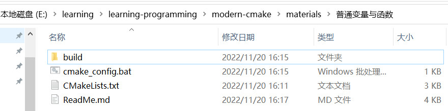

# CMAKE普通变量与函数
- 1 CMake普通变量与函数示例
    - 1.1 CMakeLists.txt
    - 1.2 执行CMake配置脚本
    - 1.3 目录结构
- 2 运行结果
    - 2.1 环境说明
    - 2.2 运行结果
    - 2.3 结论
        - 2.3.1 定义普通变量方式
        - 2.3.2 variable：表示普通变量名称；
        - 2.3.3 value：表示变量的值列表，value后面有三个点，表示变量的值可以为0或1或n个值
        - 2.3.4 PARENT_SCOPE：表示父作用域，若加此选项，特别明确定义或修改父作用域变量的值
        - 2.3.5 普通变量，在函数func作用域中，会拷贝一份父作用域的所有普通变量（即在被调用函数内可访问父作用域内的普通变量）

## 1 CMake普通变量与函数示例
### 1.1 CMakeLists.txt
```
cmake_minimum_required(VERSION 3.18)
 
# 设置工程名称
set(PROJECT_NAME KAIZEN)
 
# 设置工程版本号
set(PROJECT_VERSION "1.0.0.10" CACHE STRING "默认版本号")
 
# 工程定义
project(${PROJECT_NAME}
    LANGUAGES CXX C
    VERSION ${PROJECT_VERSION}
)
 
# 打印开始日志
message(STATUS "\n##########BEGIN_TEST")
 
# 零个值
set(MY_LOCAL_ZERO_VAR)
message(STATUS "MY_LOCAL_ZERO_VAR: ${MY_LOCAL_ZERO_VAR}")
 
# 1个值
set(MY_LOCAL_VAR "I am a local variable")
message(STATUS "MY_LOCAL_VAR_1: ${MY_LOCAL_VAR}")
 
# 在相同作用域修改普通变量
set(MY_LOCAL_VAR "I am a local variable by modify same scope")
message(STATUS "MY_LOCAL_VAR_2: ${MY_LOCAL_VAR}")
 
# 多个值
set(MY_LOCAL_LIST_VAR "kaizen" "baidu" "C++" "developer")
message(STATUS "MY_LOCAL_LIST_VAR: ${MY_LOCAL_LIST_VAR}")
 
# 定义函数func
function(func)
    # 修改父作用域普通变量值
    # 修改前打印
    message(STATUS "MY_LOCAL_VAR_3: ${MY_LOCAL_VAR}")
    # 修改动作
    set(MY_LOCAL_VAR "I am a local variable by modify func")
    # 修改后打印
    message(STATUS "MY_LOCAL_VAR_4: ${MY_LOCAL_VAR}")
    # 函数作用域内定义普通变量不加选项PARENT_SCOPE
    set(MY_FUNC_VAR "I am a func inner variable")
    # 函数作用域打印定义变量值
    message(STATUS "MY_FUNC_VAR_1: ${MY_FUNC_VAR}")
endfunction()
 
# 定义函数func_parent_scope
function(func_parent_scope)
    # 修改父作用域普通变量值
    # 修改前打印
    message(STATUS "MY_LOCAL_VAR_5: ${MY_LOCAL_VAR}")
    # 修改动作
    set(MY_LOCAL_VAR "I am a local variable by modify func_parent_scope" PARENT_SCOPE)
    # 修改后打印
    message(STATUS "MY_LOCAL_VAR_6: ${MY_LOCAL_VAR}")
    # 函数作用域内定义普通变量加选项PARENT_SCOPE
    set(MY_FUNC_VAR "I am a func inner variable" PARENT_SCOPE)
    # 函数作用域打印定义变量值
    message(STATUS "MY_FUNC_VAR_2: ${MY_FUNC_VAR}")
endfunction()
 
# 调用函数func
message(STATUS "\n########## Begin call func")
func()
message(STATUS "########## End call func")
# 调用函数func后打印
message(STATUS "MY_LOCAL_VAR_7: ${MY_LOCAL_VAR}")
# 调用函数func后打印
message(STATUS "MY_FUNC_VAR_3: ${MY_FUNC_VAR}")
 
# 调用函数func_parent_scope
message(STATUS "\n########## Begin call func_parent_scope")
func_parent_scope()
message(STATUS "########## End call func_parent_scope")
# 调用函数func_parent_scope后打印
message(STATUS "MY_LOCAL_VAR_8: ${MY_LOCAL_VAR}")
# 调用函数func_parent_scope后打印
message(STATUS "MY_FUNC_VAR_4: ${MY_FUNC_VAR}")
 
# 打印结束日志
message(STATUS "##########END_TEST\n")
```
### 1.2 执行CMake配置脚本
```
@echo off
set currentDir=%~dp0
set buildDir=%currentDir%
set cmakeOutputDir=%currentDir%\build
cmake -S %buildDir% -B %cmakeOutputDir% -G"Visual Studio 16 2019" -T v140 -A x64
pause
```

### 1.3 目录结构

- 普通变量与函数：根目录
- build：为CMake配置输出目录（在此例中即生成sln解决方案的地方）
- cmake_config.bat：执行CMake配置过程的脚本（双击直接运行）
- CMakeLists.txt：CMake脚本

## 2 运行结果
### 2.1 环境说明
本地安装VS版本：Visual Studio 2019（2019工具集）
CMake版本：3.24.1

### 2.2 运行结果
```
-- Selecting Windows SDK version 10.0.19041.0 to target Windows 10.0.19044.
-- The CXX compiler identification is MSVC 19.0.24245.0
-- The C compiler identification is MSVC 19.0.24245.0
-- Detecting CXX compiler ABI info
-- Detecting CXX compiler ABI info - done
-- Check for working CXX compiler: D:/Program Files (x86)/Microsoft Visual Studio 14.0/VC/bin/amd64/cl.exe - skipped
-- Detecting CXX compile features
-- Detecting CXX compile features - done
-- Detecting C compiler ABI info
-- Detecting C compiler ABI info - done
-- Check for working C compiler: D:/Program Files (x86)/Microsoft Visual Studio 14.0/VC/bin/amd64/cl.exe - skipped
-- Detecting C compile features
-- Detecting C compile features - done
--
##########BEGIN_TEST
-- MY_LOCAL_ZERO_VAR:
-- MY_LOCAL_VAR_1: I am a local variable
-- MY_LOCAL_VAR_2: I am a local variable by modify same scope
-- MY_LOCAL_LIST_VAR: kaizen;baidu;C++;developer
--
########## Begin call func
-- MY_LOCAL_VAR_3: I am a local variable by modify same scope
-- MY_LOCAL_VAR_4: I am a local variable by modify func
-- MY_FUNC_VAR_1: I am a func inner variable
-- ########## End call func
-- MY_LOCAL_VAR_7: I am a local variable by modify same scope
-- MY_FUNC_VAR_3:
--
########## Begin call func_parent_scope
-- MY_LOCAL_VAR_5: I am a local variable by modify same scope
-- MY_LOCAL_VAR_6: I am a local variable by modify same scope
-- MY_FUNC_VAR_2:
-- ########## End call func_parent_scope
-- MY_LOCAL_VAR_8: I am a local variable by modify func_parent_scope
-- MY_FUNC_VAR_4: I am a func inner variable
-- ##########END_TEST

-- Configuring done
-- Generating done
-- Build files have been written to: E:/learning/learning-programming/modern-cmake/materials/普通变量与函数/build
```

## 2.3 结论
### 2.3.1 定义普通变量方式
```
set(<variable> <value>... [PARENT_SCOPE])
```
### 2.3.2 variable：表示普通变量名称；
### 2.3.3 value：表示变量的值列表，value后面有三个点，表示变量的值可以为0或1或n个值
```
示例程序中第19行：定义普通变量，赋值为0个值，可理解为占位符。值为空，打印结果也为空，参见运行结果输出第16行。

示例程序中第23行：定义普通变量，赋值为1个值，即字符串中内容。参见运行结果输出第17、18行打印内容。

示例程序中第31行：定义普通变量，赋值为4个值，当多个值时，将来会用分号拼接起来为一个字符串。参见运行结果输出第19行打印内容。
```
### 2.3.4 PARENT_SCOPE：表示父作用域，若加此选项，特别明确定义或修改父作用域变量的值
### 2.3.5 普通变量，在函数func作用域中，会拷贝一份父作用域的所有普通变量（即在被调用函数内可访问父作用域内的普通变量）
- 从示例程序出发，再结合输出结果分析可知：
```
同作用域修改普通变量值，不用添加PARENT_SCOPE选项。好像是一句废话，但为了下文更好理解与函数作用域的区别，在此强调一遍。
如示例程序中第27行，对23行定义的MY_LOCAL_VAR变量进行修改值，没有添加PARENT_SCOPE选项，修改生效。
如果此场景笔误或理解错添加PARENT_SCOPE选项了呢？经笔者验证的结果：会出现CMake Warning，同时修改不会生效（即suppress 阻止）
```
- 函数作用域内修改父作用域普通变量的值，不添加PARENT_SCOPE选项，仅仅在函数作用域内有效
- 函数作用域内修改父作用域普通变量的值，添加PARENT_SCOPE选项，只表明修改父作用域变量的值（注意：不会立即生效）
  如示例程序中第55行，对父作用域第27行的MY_LOCAL_VAR变量的值进行修改，添加PARENT_SCOPE选项。
  第57行打印结果MY_LOCAL_VAR_6没有改变，仍然是原旧值（即进入函数瞬时拷贝的那份变量值，此时的修改不会立竿见影）。
  但是，退出函数后，第78行打印结果MY_LOCAL_VAR_8却是被修改后的值，即修改仅对父作用域空间内有效。
- 在函数作用域内，利用PARENT_SCOPE选项，也可为父作用域定义普通变量
  如示例程序中第61行，添加PARENT_SCOPE选项，即使退出函数后，第80行打印结果MY_FUNC_VAR_4的值不为空，即父作用域定义的普通变量有效。
  相反，第46行，没有添加PARENT_SCOPE选项，退出函数后，第71行打印结果MY_FUNC_VAR_3的值为空，即父作用域定义的普通变量被视为无效。

作者：kaizenly
出处：https://www.cnblogs.com/Braveliu/p/15600782.html
