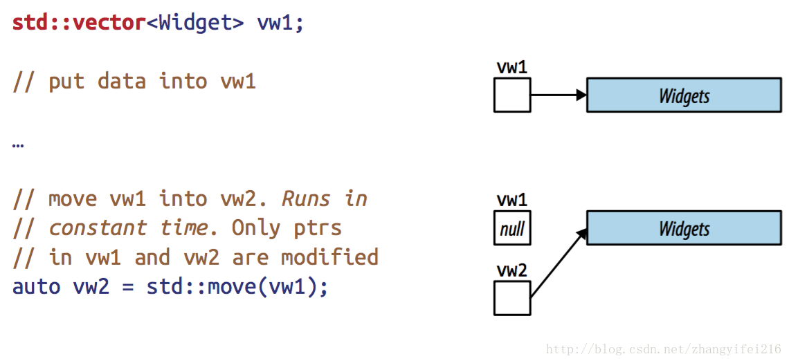
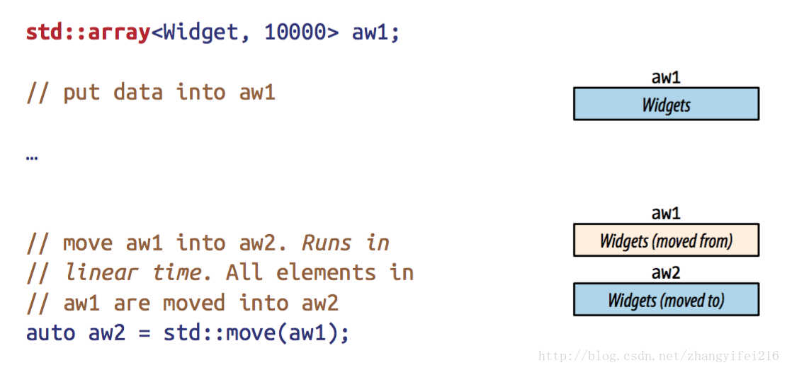

## Item29:认识移动操作的缺点
转载自：https://blog.csdn.net/zhangyifei216/article/details/54578009
* 引言
```
1. 没有移动操作的，这类对象当发起移动操作的时候会隐式转换为拷贝操作
2. 移动操作并不是非常高效，典型的就像上问中我们分析的SSO优化的string，以及std::array等
3. 移动操作不稳定的，没有声明为noexcept的，C++对于一些需要异常安全的场景下，必须使用一些noexcept的实现，所以当你的移动操作并非noexcept的时候C++并不会将拷贝操作替换成移动操作。
4. 原对象是一个左值，左值是可以通过std::move将其转换成右值进行移动操作，但是这会给使用者带来一定的困扰(具体细节见Item25)，所以应该尽可能只对右值使用移动操作。
```

在C++11新增的特性中，移动语义毫无疑问是最为重要的特性，有了这个特性后，对于STL容器的移动操作变的和拷贝一个指针一样高效。它允许编译器将那么昂亏的拷贝操作替换成高效的移动操作，将你的代码重新用C++11编译一遍后，你会发现你的代码运行的更快了。

C++的标准库已经针对C++11经过大量的修改，添加了对移动操作的支持，通过移动语义实现起来比之前的拷贝实现高效多了，我们可以放心的对C++标准库中的一些对象使用移动操作，但是我们周围的一些代码并没有针对C++11做修改，这些代码很多是不支持移动语义的，如果你期望编译器帮这些代码生成默认的移动构造函数的话，那么可能会让你失望了，在Item17中提到过，只有在用户没有自定义的拷贝操作和自定义的析构操作的时候，编译器才会帮我们生成默认的移动操作，所以在这种情况下我们没办法享受移动操作带给我们的效率上的提升。

虽然说C++11中的容器都已经支持移动操作，但这并不意味着一定会带来性能上的提升，就拿C++11中的std::array来说，本质上来说，这是一个使用了STL接口的风格来写的数组。和其他容器不同的是它的数据是直接作为类的数据成员，而不是像其他容器那样放在堆上，然后通过一个数据成员指针指向这个堆。这种通过数据成员指针指向堆上的方式移动操作最高效了，只需要改变指针的指向即可完成，如下图 :

但是std::array缺乏这个指针，没有办法向其他容器一样直接通过改变指针的指向高效的实现移动，std::array的数据是直接以数据成员的方式放在类的内部，所以在移动的时候需要一个个元素进行拷贝或者移动，如下图:

除了上面提到的这个容器外，还有另外一个大家经常使用的string，它提供了常量时间高效的移动操作，和线性时间的拷贝操作，听起来好像我们应该优先使用高效的移动操作，但是事情可能并非和我们想象的一样，string有很多不同的实现方式，有一种实现方式是SSO(small string optimization)，对于小字符串是直接存放在对象的中，不使用堆上内存。因此对于这种使用了SSO优化的string来说其移动操作并不比拷贝操作高效。
